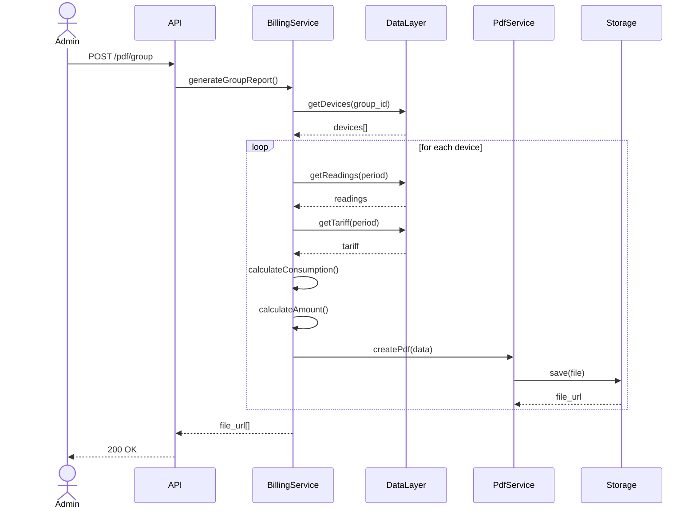
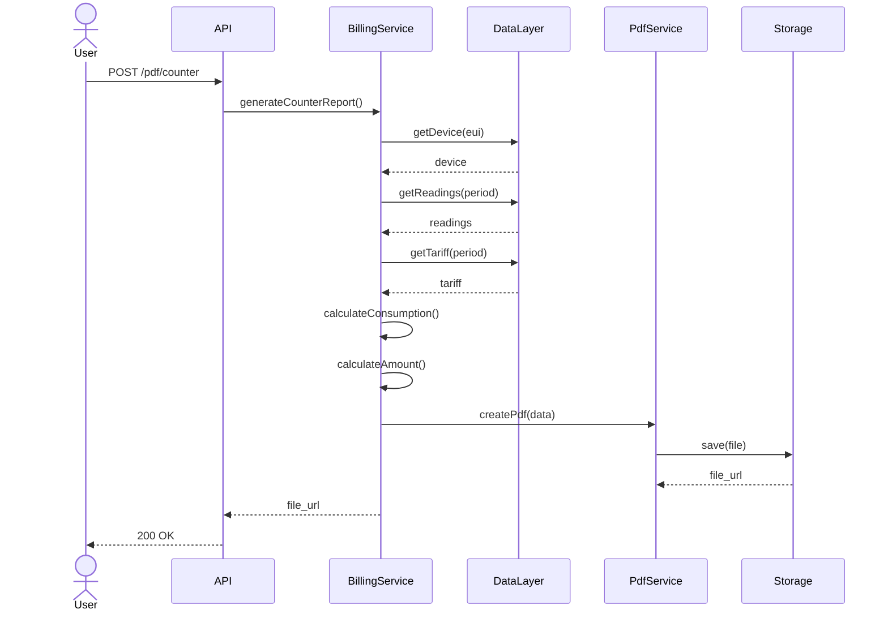

# Сервис генерации PDF-отчётов по приборам учёта

## Назначение системы

Система предназначена для:

- формирования групповых отчётов по группе приборов,
- формирования индивидуальных квитанций по конкретному прибору,
- расчёта потребления и начислений на основе показаний и тарифов,
- сохранения и предоставления ссылки на сформированный PDF-документ.


# Функциональные требования

## Генерация группового отчёта

### Описание

Система должна обеспечивать формирование отчёта по всем приборам, входящим в указанную группу.

### Входные параметры

| Параметр | Тип           | Обязательный | Описание                |
| -------- | ------------- | ------------ | ----------------------- |
| group_id | UUID / string | Да           | Идентификатор группы    |
| offset   | integer       | Нет          | Смещение временной зоны |

### Логика обработки

1. Получить список приборов группы.
2. Для каждого прибора:
    - получить показания за период,
    - получить применимый тариф,
    - рассчитать объём потребления,
    - рассчитать сумму начисления.
3. Сформировать PDF-документ.
4. Сохранить файл в хранилище.
5. Вернуть список ссылок на файлы.

### Диаграмма последовательности



---

## Генерация индивидуальной квитанции

### Описание

Система должна обеспечивать формирование квитанции по одному прибору учёта.

### Входные параметры

| Параметр | Тип      | Обязательный | Описание                         |
| -------- | -------- | ------------ | -------------------------------- |
| eui      | string   | Да           | Уникальный идентификатор прибора |
| from     | datetime | Да           | Начало периода                   |
| to       | datetime | Да           | Конец периода                    |

### Логика обработки

1. Получить данные прибора.
2. Получить показания за указанный период.
3. Получить действующий тариф.
4. Рассчитать потребление.
5. Рассчитать начисления.
6. Сформировать PDF.
7. Сохранить документ.
8. Вернуть ссылку на файл.

### Диаграмма последовательности




## Формат ответа

### Успешный ответ:

```json
{
  "status": "success",
  "file_url": "https://storage.example.com/file.pdf"
}
```

### Ответ при ошибке:

```json
{
  "status": "error",
  "code": "PDF_GENERATION_FAILED",
  "message": "Ошибка генерации PDF"
}
```


## Возможные ошибки

| Код ошибки            | Описание                |
| --------------------- | ----------------------- |
| DEVICE_NOT_FOUND      | Прибор не найден        |
| TARIFF_NOT_FOUND      | Тариф не найден         |
| READINGS_NOT_FOUND    | Нет показаний за период |
| PDF_GENERATION_FAILED | Ошибка генерации PDF    |
| STORAGE_ERROR         | Ошибка сохранения файла |

---

# Нефункциональные требования

## Производительность

* Время генерации одного PDF — не более 5 секунд.
* Поддержка пакетной генерации не менее 100 приборов за один запрос.

## Надёжность

* Повторная попытка генерации при временных сбоях.
* Логирование всех ошибок.

## Масштабируемость

* Возможность горизонтального масштабирования.
* Возможность вынесения PdfService в отдельный сервис.

## Требования к хранению данных

* PDF-файлы должны сохраняться в объектном хранилище.
* Должна обеспечиваться уникальность имён файлов.
* Должна быть предусмотрена возможность последующего удаления или архивации.

---


# Ограничения и допущения

* Период расчёта определяется на основе входных параметров.
* Тариф считается неизменным в пределах расчётного периода.
* Система не выполняет финансовую агрегацию по нескольким периодам.
