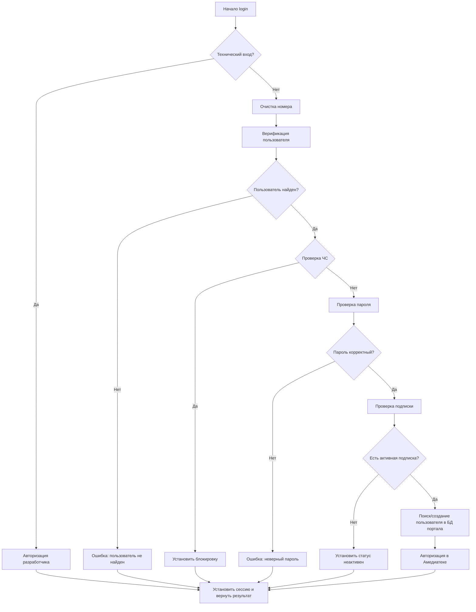

# Документация: Регистрация и авторизация на портале

## 📋 Оглавление
1. [Обзор системы](#обзор-системы)  
2. [User Stories](#user-stories)  
3. [Функция авторизации `login`](#функция-login)  
4. [Алгоритм работы](#алгоритм-работы)  
5. [Структуры данных](#структуры-данных)  
6. [Ошибки и обработка исключений](#ошибки-и-обработка-исключений)  
7. [Безопасность](#безопасность)  

---

##  Обзор системы

Система обеспечивает регистрацию и авторизацию пользователей на портале с интеграцией со сторонним сервисом Амедиатека. Основные цели:  

- Обеспечение безопасного входа пользователей.  
- Проверка наличия подписки и блокировок.  
- Синхронизация данных между порталом и внешним сервисом.  

###  Основные функции
- Регистрация пользователей по SMS.  
- Авторизация через номер телефона и пароль.  
- Автоматическая регистрация в Амедиатеке при первой авторизации.  
- Проверка пользователей на наличие в черных списках.  
- Верификация активных подписок.  
- Синхронизация данных между порталами.  

---

##  User Stories

### User Story 1: Регистрация по SMS
**Роль:** новый пользователь  
**Цель:** зарегистрироваться на портале с минимальными действиями  
**Результат:** пользователь получает доступ к сервису.  

### User Story 2: Авторизация
**Роль:** зарегистрированный пользователь  
**Цель:** войти на портал используя номер телефона и пароль  
**Результат:** доступ к аккаунту и контенту.

---

##  Функция авторизации `login`

### Входные параметры

| Параметр  | Тип    | Обязателен | Описание                          | Пример               |
|-----------|--------|------------|-----------------------------------|---------------------|
| `login`   | string | Да         | Номер телефона пользователя       | "+7 (999) 123-45-67"|
| `password`| string | Да         | Пароль в открытом виде            | "myPassword123"      |

### Основные шаги функции
1. Проверка технического входа (для разработчика).  
2. Очистка и нормализация номера телефона.  
3. Верификация пользователя через API внешней системы.  
4. Проверка черного списка.  
5. Проверка корректности пароля.  
6. Проверка подписки и блокировок.  
7. Регистрация пользователя в базе портала при необходимости.  
8. Авторизация в стороннем сервисе.  
9. Установка сессии и возврат результата.  

---

##  Алгоритм работы

---

## Структуры данных

### Сессионные переменные

| Переменная     | Тип    | Описание                     |
| -------------- | ------ | ---------------------------- |
| `user_id`      | int    | ID пользователя в БД портала |
| `user_phone`   | string | Номер телефона               |
| `user_name`    | string | Имя пользователя             |
| `amedia_id`    | string | ID пользователя в Амедиатеке |
| `amedia_token` | string | Токен авторизации Амедиатеки |
| `logged_in`    | bool   | Флаг успешного входа         |

### Таблица пользователей портала (portal_users)

| Поле       | Тип          | Описание                 | Пример              |
| ---------- | ------------ | ------------------------ | ------------------- |
| id         | INT          | Уникальный идентификатор | 12345               |
| phone      | VARCHAR(20)  | Номер телефона           | 79991234567         |
| name       | VARCHAR(255) | Имя пользователя         | Иван Иванов         |
| amedia_id  | VARCHAR(50)  | ID в Амедиатеке          | amedia_user_789     |
| created_at | DATETIME     | Дата создания            | 2024-01-15 10:30:00 |
| last_login | DATETIME     | Последний вход           | 2024-01-15 14:20:00 |
| is_active  | TINYINT(1)   | Активен ли аккаунт       | 1                   |

---

## Ошибки и обработка

| Сценарий                     | Пример ответа                                        |
| ---------------------------- | ---------------------------------------------------- |
| Пользователь не найден       | `{ "auth": "N", "error": "Пользователь не найден" }` |
| Неверный пароль              | `{ "auth": "N", "error_pass": true }`                |
| Пользователь в черном списке | `{ "auth": "N", "blocking": "Y" }`                   |
| Финансовая блокировка        | `{ "auth": "N", "active": "Y", "blocking": "Y" }`    |
| Технический вход             | `{ "auth": "Y", "developer": "Y" }`                  |

---

## Безопасность

| Мера                               | Описание                                      |
| ---------------------------------- | --------------------------------------------- |
| Хэширование паролей                | Все пароли хранятся в виде двойного MD5       |
| Очистка входных данных             | Номера телефонов очищаются от лишних символов |
| Проверка черных списков            | Блокировка пользователей из черных списков    |
| Ограничение попыток входа          | Защита от brute-force атак                    |
| HTTPS соединение                   | Все вызовы API защищены SSL/TLS               |
| Валидация токенов внешних сервисов | Токены имеют ограниченное время жизни         |

---

## Мониторинг

| Метрика                  | Описание                                       |
| ------------------------ | ---------------------------------------------- |
| Успешные авторизации     | Количество успешных входов пользователей в час |
| Неудачные попытки        | Количество ошибок авторизации                  |
| Среднее время ответа     | Время выполнения функции login                 |
| Частота блокировок       | Количество пользователей в черных списках      |
| Регистрации в Амедиатеке | Количество новых регистраций через интеграцию  |

