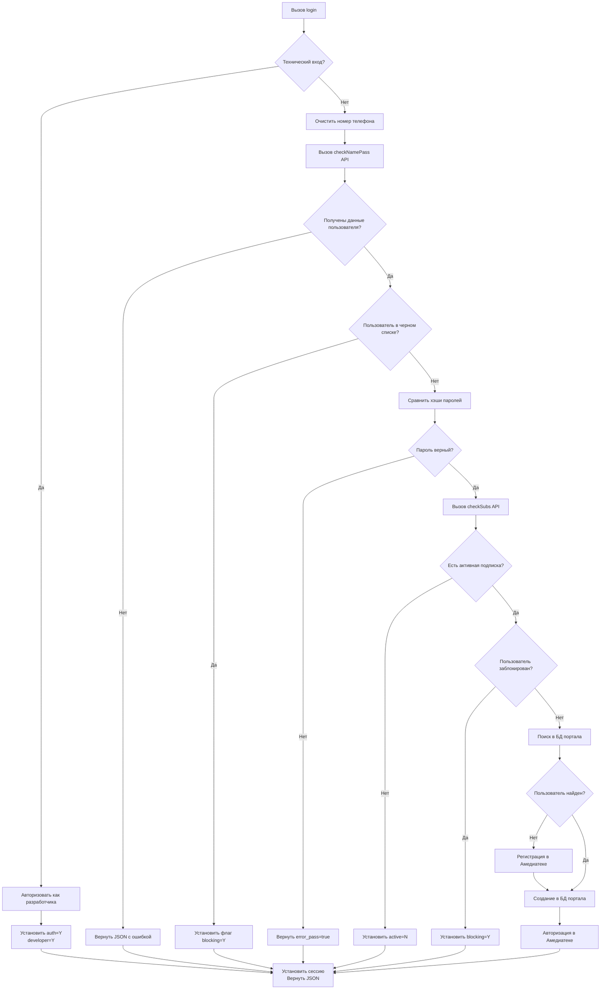

# Регистрация и авторизация на портале

## 📋 Оглавление
1. [Обзор системы](#обзор-системы)
2. [User Stories](#user-stories)
3. [Функция login](#функция-login)
4. [Алгоритм работы](#алгоритм-работы)
5. [Структуры данных](#структуры-данных)
6. [Примеры использования](#примеры-использования)

---

## 🎯 Обзор системы

Система регистрации и авторизации пользователей на портале с интеграцией с сервисом Амедиатеки. Система обеспечивает безопасную аутентификацию, проверку подписок и синхронизацию данных между порталом и сторонним сервисом.

### 🔐 Основные функции
- 📱 Регистрация по SMS (без описания в данной документации)
- 🔑 Авторизация по номеру телефона и паролю
- 🔄 Автоматическая регистрация в Амедиатеке при первой авторизации
- ⚠️ Проверка пользователей на наличие в черных списках
- 💳 Верификация активных подписок
- 🔗 Синхронизация данных между порталом и Амедиатекой

---

## 👤 User Stories

### User Story 1: Регистрация по SMS
**Как** новый пользователь,  
**Я хочу** зарегистрироваться на портале по SMS,  
**Чтобы** получить доступ к сервису без сложных процедур регистрации.

*Примечание: Регистрация по SMS является отдельным процессом и не описана в данной документации.*

### User Story 2: Авторизация
**Как** зарегистрированный пользователь,  
**Я хочу** войти на портал используя номер телефона и пароль,  
**Чтобы** получить доступ к своему аккаунту и контенту.

---

## 🔑 Функция `login`

### 📥 Входные параметры

| Параметр | Тип | Обязателен | Описание | Пример |
|----------|-----|------------|----------|--------|
| `login` | `string` | Да | Номер телефона пользователя | `"79991234567"`, `"+7 (999) 123-45-67"` |
| `password` | `string` | Да | Пароль в открытом виде (будет преобразован в двойной MD5) | `"myPassword123"` |

### 🎯 Назначение
Функция выполняет полный цикл аутентификации пользователя, включая проверку учетных данных, валидацию подписки, синхронизацию с сервисом Амедиатеки и установку сессионных данных.

### 🛡️ Проверки безопасности
1. ✅ Проверка на технический вход (доступ разработчика)
2. ✅ Очистка и нормализация номера телефона
3. ✅ Валидация учетных данных через внешний API
4. ✅ Проверка наличия в черном списке
5. ✅ Сверка хэшированного пароля
6. ✅ Верификация активной подписки
7. ✅ Проверка/создание учетной записи в БД портала
8. ✅ Регистрация/авторизация в сервисе Амедиатеки

---

## 🔄 Алгоритм работы



### 📋 Детальное описание шагов

#### Шаг 1: Проверка технического входа
```php
if ($login === DEV_LOGIN && $password === DEV_PASSWORD) {
    // Авторизация разработчика
    $_SESSION['developer'] = true;
    $_SESSION['user_id'] = DEV_USER_ID;
    return json_encode([
        'auth' => 'Y',
        'developer' => 'Y',
        'active' => 'Y',
        'blocking' => 'N'
    ]);
}
```

#### Шаг 2: Нормализация номера телефона
```php
$cleanPhone = preg_replace('/[^0-9]/', '', $login);
// Пример: "+7 (999) 123-45-67" → "79991234567"
```

#### Шаг 3: Валидация через внешний API (`checkNamePass`)
```php
$userData = callCheckNamePassAPI($cleanPhone);
if (!$userData || !isset($userData->payload->user->phone)) {
    return json_encode([
        'auth' => 'N',
        'active' => 'N',
        'blocking' => 'N',
        'error' => 'Пользователь не найден'
    ]);
}
```

#### Шаг 4: Проверка черного списка
```php
if (isset($userData->payload->in_blacklist) && $userData->payload->in_blacklist) {
    return json_encode([
        'auth' => 'N',
        'active' => 'N',
        'blocking' => 'Y',
        'error' => 'Пользователь в черном списке'
    ]);
}
```

#### Шаг 5: Проверка пароля
```php
$inputPasswordHash = md5(md5($password));
$storedPasswordHash = $userData->payload->user->password;

if ($inputPasswordHash !== $storedPasswordHash) {
    return json_encode([
        'auth' => 'N',
        'active' => 'N',
        'blocking' => 'N',
        'error_pass' => true
    ]);
}
```

#### Шаг 6: Проверка подписки (`checkSubs`)
```php
$subscriptionData = callCheckSubsAPI($cleanPhone);
$hasActiveSubscription = isset($subscriptionData->active) && $subscriptionData->active;
$isBlocked = isset($subscriptionData->blocking) && $subscriptionData->blocking;

if ($isBlocked) {
    return json_encode([
        'auth' => 'N',
        'active' => $hasActiveSubscription ? 'Y' : 'N',
        'blocking' => 'Y',
        'error' => 'Финансовая блокировка'
    ]);
}
```

#### Шаг 7: Поиск/создание пользователя в БД портала
```php
// Поиск в базе данных портала
$portalUser = findUserInPortalDB($cleanPhone);

if (!$portalUser) {
    // Регистрация в Амедиатеке
    $amediaRegistration = registerInAmediaAPI($cleanPhone);
    
    if (!$amediaRegistration->success) {
        return json_encode([
            'auth' => 'N',
            'active' => 'N',
            'blocking' => 'N',
            'error' => 'Ошибка регистрации в Амедиатеке'
        ]);
    }
    
    // Создание пользователя в БД портала
    $portalUser = createUserInPortalDB([
        'phone' => $cleanPhone,
        'amedia_id' => $amediaRegistration->user_id,
        'name' => $userData->payload->user->name ?? '',
        'created_at' => date('Y-m-d H:i:s')
    ]);
}
```

#### Шаг 8: Авторизация в Амедиатеке
```php
$amediaAuth = authorizeInAmediaAPI($portalUser['amedia_id']);

if (!$amediaAuth->success) {
    return json_encode([
        'auth' => 'N',
        'active' => $hasActiveSubscription ? 'Y' : 'N',
        'blocking' => 'N',
        'error' => 'Ошибка авторизации в Амедиатеке'
    ]);
}
```

#### Шаг 9: Установка сессии и возврат результата
```php
// Установка сессионных переменных
$_SESSION['user_id'] = $portalUser['id'];
$_SESSION['user_phone'] = $portalUser['phone'];
$_SESSION['user_name'] = $portalUser['name'];
$_SESSION['amedia_id'] = $portalUser['amedia_id'];
$_SESSION['amedia_token'] = $amediaAuth->token;
$_SESSION['logged_in'] = true;

// Возврат успешного результата
return json_encode([
    'auth' => 'Y',
    'active' => $hasActiveSubscription ? 'Y' : 'N',
    'blocking' => 'N',
    'error_pass' => false,
    'user' => [
        'id' => $portalUser['id'],
        'name' => $portalUser['name'],
        'phone' => $portalUser['phone']
    ],
    'amedia' => [
        'user_id' => $amediaAuth->user_id,
        'token_expires' => $amediaAuth->expires_at
    ]
]);
```

---

## 📊 Выходные данные

### Формат ответа JSON

```json
{
    "auth": "Y",
    "active": "Y",
    "blocking": "N",
    "error_pass": false,
    "user": {
        "id": 12345,
        "name": "Иван Иванов",
        "phone": "79991234567"
    },
    "amedia": {
        "user_id": "amedia_user_789",
        "token_expires": "2024-12-31T23:59:59Z"
    }
}
```

### 📋 Описание полей ответа

| Поле | Тип | Значения | Описание |
|------|-----|----------|----------|
| `auth` | `string` | `"Y"`, `"N"` | Статус авторизации |
| `active` | `string` | `"Y"`, `"N"` | Наличие активной подписки |
| `blocking` | `string` | `"Y"`, `"N"` | Наличие блокировки (черный список или финансовая блокировка) |
| `error_pass` | `boolean` | `true`, `false` | Ошибка пароля |
| `user.id` | `integer` | - | ID пользователя в БД портала |
| `user.name` | `string` | - | Имя пользователя |
| `user.phone` | `string` | - | Номер телефона (очищенный) |
| `amedia.user_id` | `string` | - | ID пользователя в Амедиатеке |
| `amedia.token_expires` | `string` | ISO 8601 | Время истечения токена Амедиатеки |

### ⚠️ Возможные ошибки

#### Сценарий 1: Пользователь не найден
```json
{
    "auth": "N",
    "active": "N",
    "blocking": "N",
    "error": "Пользователь не найден"
}
```

#### Сценарий 2: Пользователь в черном списке
```json
{
    "auth": "N",
    "active": "N",
    "blocking": "Y",
    "error": "Пользователь в черном списке"
}
```

#### Сценарий 3: Неверный пароль
```json
{
    "auth": "N",
    "active": "N",
    "blocking": "N",
    "error_pass": true
}
```

#### Сценарий 4: Финансовая блокировка
```json
{
    "auth": "N",
    "active": "Y",
    "blocking": "Y",
    "error": "Финансовая блокировка"
}
```

#### Сценарий 5: Технический вход (разработчик)
```json
{
    "auth": "Y",
    "developer": "Y",
    "active": "Y",
    "blocking": "N"
}
```

---

## 🗄️ Структуры данных

### Сессионные переменные
После успешной авторизации устанавливаются следующие сессионные переменные:

| Переменная | Тип | Описание |
|------------|-----|----------|
| `$_SESSION['user_id']` | `int` | ID пользователя в БД портала |
| `$_SESSION['user_phone']` | `string` | Номер телефона |
| `$_SESSION['user_name']` | `string` | Имя пользователя |
| `$_SESSION['amedia_id']` | `string` | ID пользователя в Амедиатеке |
| `$_SESSION['amedia_token']` | `string` | Токен авторизации Амедиатеки |
| `$_SESSION['logged_in']` | `bool` | Флаг авторизации |
| `$_SESSION['developer']` | `bool` | Флаг разработчика (только для тех. входа) |

### Таблица пользователей портала (`portal_users`)
| Поле | Тип | Описание | Пример |
|------|-----|----------|--------|
| `id` | INT | Первичный ключ | `12345` |
| `phone` | VARCHAR(20) | Номер телефона | `79991234567` |
| `name` | VARCHAR(255) | Имя пользователя | `Иван Иванов` |
| `amedia_id` | VARCHAR(50) | ID в Амедиатеке | `amedia_user_789` |
| `created_at` | DATETIME | Дата создания | `2024-01-15 10:30:00` |
| `last_login` | DATETIME | Последний вход | `2024-01-15 14:20:00` |
| `is_active` | TINYINT(1) | Активен ли аккаунт | `1` |

---


## 🏗️ Архитектура интеграции
```
┌─────────────────┐     ┌─────────────────┐     ┌─────────────────┐
│   Клиентский    │     │     Портал      │     │   Внешние API   │
│    интерфейс    │────▶│   (Backend)     │────▶│    (Амедиатека, │
│   (Frontend)    │     │                 │     │   Проверки)     │
└─────────────────┘     └─────────────────┘     └─────────────────┘
        │                        │                        │
        │ 1. Запрос авторизации  │ 2. Валидация данных    │ 3. Регистрация/
        │    (login, password)   │    (очистка телефона)  │    авторизация
        │                        │                        │
        │ 8. Результат (JSON)    │ 4. Проверка ЧС         │
        │◀───────────────────────│ 5. Проверка пароля     │
        │                        │ 6. Проверка подписки   │
        │                        │ 7. Синхронизация БД    │
```

---

## 🔒 Безопасность

### Меры безопасности
1. **Хэширование паролей**: Все пароли хранятся в виде двойного MD5 хэша
2. **Очистка входных данных**: Номера телефонов очищаются от нечисловых символов
3. **Проверка черных списков**: Блокировка пользователей из черных списков
4. **Ограничение попыток входа**: Защита от brute-force атак
5. **HTTPS соединение**: Все API вызовы защищены SSL/TLS
6. **Валидация токенов**: Токены Амедиатеки имеют ограниченное время жизни

### Логирование безопасности
```php
// Запись логов авторизации
function logAuthAttempt($phone, $success, $ip, $userAgent) {
    $logEntry = [
        'timestamp' => date('Y-m-d H:i:s'),
        'phone' => $phone,
        'success' => $success,
        'ip_address' => $ip,
        'user_agent' => $userAgent,
        'action' => 'login_attempt'
    ];
    
    // Запись в базу данных или файл логов
    writeToSecurityLog($logEntry);
}
```

---

## 🐛 Отладка и мониторинг

### Логирование операций
```php
// Структура лога авторизации
$authLog = [
    'timestamp' => date('Y-m-d H:i:s'),
    'phone' => $cleanPhone,
    'step' => 'complete',
    'result' => $resultStatus,
    'session_id' => session_id(),
    'ip_address' => $_SERVER['REMOTE_ADDR'],
    'user_agent' => $_SERVER['HTTP_USER_AGENT'],
    'execution_time' => microtime(true) - $startTime,
    'errors' => $errors ?? []
];
```

### Метрики мониторинга
- **Успешные авторизации**: Количество успешных входов в час
- **Неудачные попытки**: Количество ошибок авторизации
- **Среднее время ответа**: Время выполнения функции login
- **Частота блокировок**: Количество пользователей в черных списках
- **Регистрации в Амедиатеке**: Количество новых регистраций

---

## Частые проблемы

1. **"Пользователь не найден"**
   - Проверить корректность номера телефона
   - Убедиться, что пользователь зарегистрирован во внешней системе
   - Проверить доступность API `checkNamePass`

2. **"Неверный пароль"**
   - Проверить кодировку пароля
   - Убедиться в правильности хэширования (двойной MD5)
   - Проверить синхронизацию паролей между системами

3. **"Ошибка регистрации в Амедиатеке"**
   - Проверить доступность API Амедиатеки
   - Убедиться в корректности передаваемых данных
   - Проверить квоты API вызовов

4. **"Сессия не устанавливается"**
   - Проверить настройки session_start()
   - Убедиться в отсутствии вывода до установки сессии
   - Проверить права на запись сессий


---

*Документация обновлена: 2025-04-03*  
*Версия системы: 2.0.0*  
*Последние изменения: Добавлена интеграция с Амедиатекой, улучшена безопасность*