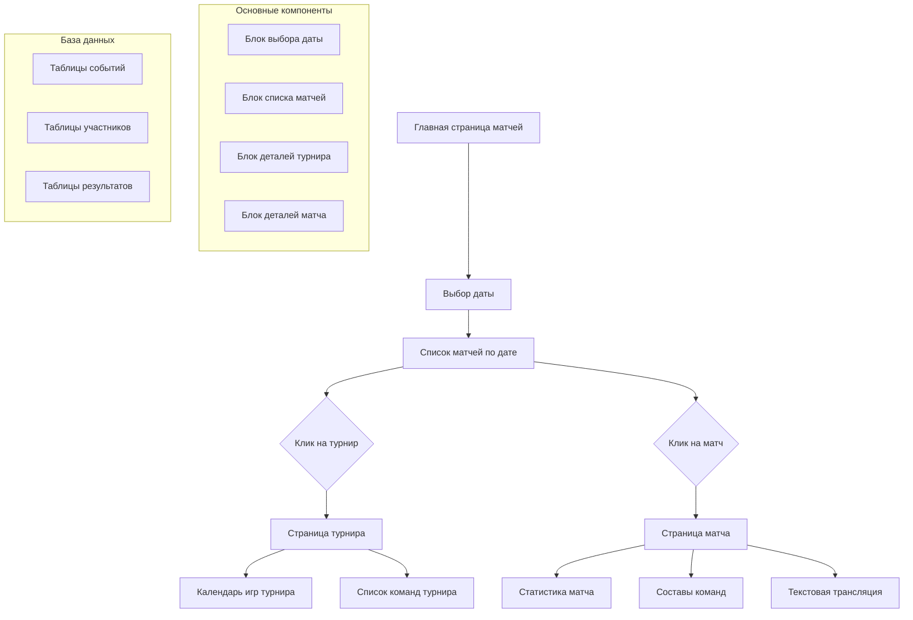
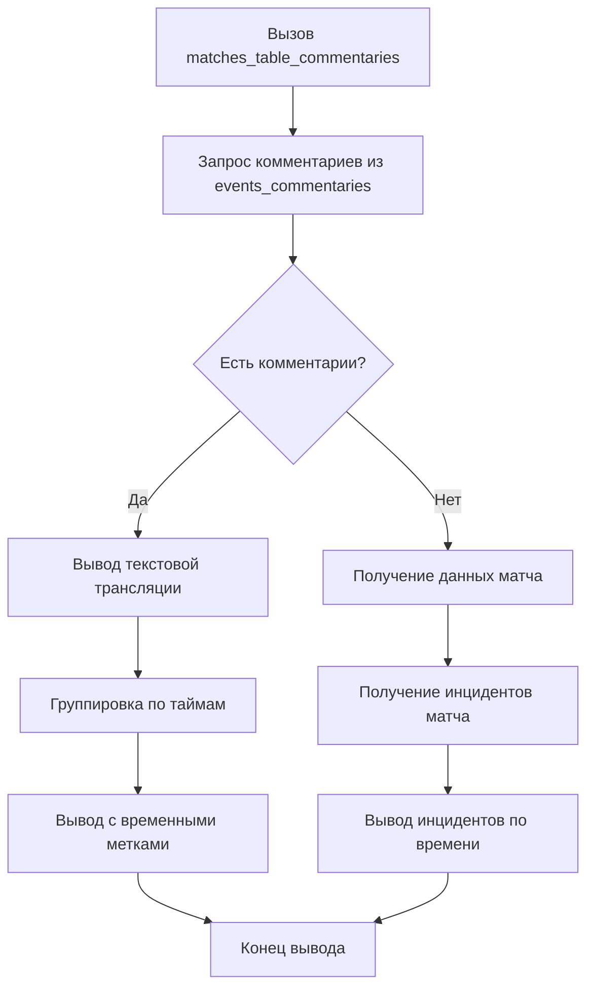

# Система просмотра спортивных матчей и турниров

## 📋 Оглавление
1. [Обзор системы](#обзор-системы)
2. [Архитектура системы](#архитектура-системы)
3. [User Case 1: Просмотр страницы матчей](#user-case-1-просмотр-страницы-матчей)
4. [User Case 2: Просмотр страницы турнира](#user-case-2-просмотр-страницы-турнира)
5. [User Case 3: Просмотр страницы матча](#user-case-3-просмотр-страницы-матча)
6. [Структуры данных](#структуры-данных)
7. [API Reference](#api-reference)
8. [Примеры использования](#примеры-использования)

---

## 🎯 Обзор системы

Система для отображения спортивных событий, предоставляющая пользователям возможность просматривать матчи, турниры и детальную информацию о спортивных мероприятиях в реальном времени.

### 🏆 Основные возможности
- 📅 **Календарь матчей**: Просмотр событий по датам с фильтрацией по видам спорта
- 🏅 **Детали турниров**: Информация о турнирах, командах-участниках и расписании
- ⚽ **Детали матчей**: Полная информация о матчах, включая составы, статистику и комментарии
- 🎯 **Адаптивный интерфейс**: Разные режимы отображения для различных устройств
- 🔄 **Реальное время**: Отображение текущих результатов и событий матчей

---

## 🏗️ Архитектура системы

### Общая схема взаимодействия


### Структура базы данных
```
📁 Основные таблицы:
├── events (спортивные события)
│   ├── id
│   ├── tournament_id
│   ├── start_date
│   ├── status
│   └── sport_type
│
├── event_participants (участники событий)
│   ├── event_id
│   ├── participant_id
│   ├── team_id
│   └── participant_number
│
├── event_participants_result (результаты участников)
│   ├── participant_id
│   ├── result_code
│   └── result_value
│
├── tournament_stages (стадии турниров)
│   ├── tournament_id
│   ├── stage_name
│   └── stage_order
│
├── events_venue (места проведения)
│   ├── event_id
│   ├── venue_name
│   └── city
│
├── events_formation (расстановка команд)
│   ├── event_id
│   ├── team_id
│   └── formation_data
│
├── events_lineup (составы команд)
│   ├── event_id
│   ├── player_id
│   └── position
│
└── events_commentaries (комментарии к матчам)
    ├── event_id
    ├── minute
    └── commentary_text
```

---

## 📅 User Case 1: Просмотр страницы матчей

### 🎯 User Stories
#### **Job Story 1: Вывод всех матчей с группировкой по турнирам**
**Как** пользователь спортивного портала,  
**Я хочу** видеть все матчи на выбранную дату сгруппированными по турнирам,  
**Чтобы** легко находить интересующие меня спортивные события.

#### **User Story 1: Выбор даты для вывода матчей**
**Как** пользователь,  
**Я хочу** выбирать дату из календаря,  
**Чтобы** просматривать матчи на конкретный день.

### 🛠️ Компоненты системы

#### 1. Блок выбора даты
**Функция:** `print_data_select()`

**Назначение:** Отображение интерфейса для выбора даты просмотра матчей.

**Реализация:**
```php
function print_data_select() {
    echo '
    <div class="date-selector">
        <h3>Выберите дату</h3>
        <div class="calendar-container">
            <input type="text" 
                   id="match-date" 
                   class="datepicker" 
                   value="' . date('Y-m-d') . '">
            <button onclick="loadMatchesForDate()">
                Показать матчи
            </button>
        </div>
    </div>';
    
    // Инициализация календаря
    print_calendar_v2();
}
```

#### 2. Календарь выбора даты
**Функция:** `print_calendar_v2()`

**Назначение:** Генерация HTML и JavaScript для интерактивного выбора даты.

**Особенности:**
- Использует библиотеку datetimepicker
- Поддержка локализации (русский язык)
- Валидация выбранных дат
- Автоматическое обновление списка матчей при выборе даты

**Пример реализации:**
```javascript
function initializeCalendar() {
    $('#match-date').datetimepicker({
        format: 'YYYY-MM-DD',
        locale: 'ru',
        defaultDate: moment(),
        maxDate: moment().add(1, 'year'),
        minDate: moment().subtract(1, 'year')
    });
    
    $('#match-date').on('dp.change', function(e) {
        loadMatchesForDate(e.date.format('YYYY-MM-DD'));
    });
}
```

#### 3. Основная функция отображения матчей
**Функция:** `ltFn(sport, date)`

**Назначение:** Получение и отображение спортивных событий по указанным критериям.

**Параметры:**
| Параметр | Тип | Обязателен | Описание | По умолчанию |
|----------|-----|------------|----------|--------------|
| `sport` | `string` | Нет | Вид спорта для фильтрации | `'all'` |
| `date` | `string` | Нет | Дата в формате Y-m-d | Текущая дата |

**Алгоритм работы:**
```mermaid
graph TD
    A[Вызов ltFn(sport, date)] --> B[Нормализация параметров]
    B --> C[Определение даты]
    C --> D[Запрос событий из БД]
    
    D --> E{Найдены события?}
    E -->|Нет| F[Вывод 'no_events_planned']
    E -->|Да| G[Для каждого события]
    
    G --> H[Получение участников<br/>fetchMatchParticipants]
    H --> I[Получение стадий турнира<br/>fetchMatchTournamentStages]
    I --> J[Получение результатов<br/>fetchParticipantResults]
    
    J --> K[Структурирование данных]
    K --> L[Следующее событие?]
    L -->|Да| G
    L -->|Нет| M[Группировка по турнирам]
    
    M --> N{Определение типа отображения}
    N -->|Ширина > 1000px| O[Двухколоночный lt_50]
    N -->|Ширина ≤ 1000px| P[Одноколоночный lt_100]
    
    O --> Q[Вывод HTML]
    P --> Q
```

**Пример структуры возвращаемых данных:**
```php
$matchesData = [
    'tournament_123' => [
        'name' => 'Премьер-лига Англии',
        'season' => '2023/2024',
        'country' => 'Англия',
        'sport' => 'футбол',
        'events' => [
            'match_456' => [
                'status' => 'Завершен',
                'status_en' => 'Finished',
                'startdate' => '2024-01-15 20:00:00',
                'venue' => 'Стадион "Олд Траффорд"',
                'participants' => [
                    'participant_789' => [
                        'name_ru' => 'Манчестер Юнайтед',
                        'name_en' => 'Manchester United',
                        'number' => 1,
                        'team_id' => 789,
                        'goals' => 3,
                        'possession' => 62,
                        'shots' => 15
                    ],
                    'participant_790' => [
                        'name_ru' => 'Ливерпуль',
                        'name_en' => 'Liverpool',
                        'number' => 2,
                        'team_id' => 790,
                        'goals' => 1,
                        'possession' => 38,
                        'shots' => 8
                    ]
                ]
            ],
            'match_457' => [
                // Другой матч этого же турнира
            ]
        ]
    ],
    'tournament_124' => [
        // Другой турнир
    ]
];
```

### 🎨 Интерфейс отображения

#### Двухколоночный режим (`lt_50`)
```
┌─────────────────────────────────────┬─────────────────────────────────────┐
│           ТУРНИР 1                   │           ТУРНИР 2                  │
├─────────────────────────────────────┼─────────────────────────────────────┤
│ ⚽ Матч 1                           │ 🏀 Матч 3                          │
│   Манчестер Юнайтед vs Ливерпуль    │   Лейкерс vs Уорриорз               │
│   Статус: Завершен                  │   Статус: Идет                      │
│   Счет: 3:1                         │   Счет: 89:85                       │
│   20:00, 15.01.2024                 │   21:30, 15.01.2024                 │
│                                     │                                     │
│ ⚽ Матч 2                           │ 🏀 Матч 4                          │
│   Челси vs Арсенал                  │   Селтикс vs Буллз                  │
│   Статус: Запланирован              │   Статус: Запланирован              │
│   Счет: -:-                         │   Счет: -:-                         │
│   22:30, 15.01.2024                 │   23:00, 15.01.2024                 │
└─────────────────────────────────────┴─────────────────────────────────────┘
```

#### Одноколоночный режим (`lt_100`)
```
┌─────────────────────────────────────────────────────────────────────────┐
│                           ТУРНИР 1                                      │
├─────────────────────────────────────────────────────────────────────────┤
│ ⚽ Матч 1: Манчестер Юнайтед vs Ливерпуль                               │
│    Статус: Завершен | Счет: 3:1 | 20:00, 15.01.2024                    │
│                                                                         │
│ ⚽ Матч 2: Челси vs Арсенал                                             │
│    Статус: Запланирован | Счет: -:- | 22:30, 15.01.2024                │
├─────────────────────────────────────────────────────────────────────────┤
│                           ТУРНИР 2                                      │
├─────────────────────────────────────────────────────────────────────────┤
│ 🏀 Матч 3: Лейкерс vs Уорриорз                                         │
│    Статус: Идет | Счет: 89:85 | 21:30, 15.01.2024                      │
│                                                                         │
│ 🏀 Матч 4: Селтикс vs Буллз                                             │
│    Статус: Запланирован | Счет: -:- | 23:00, 15.01.2024                │
└─────────────────────────────────────────────────────────────────────────┘
```

---

## 🏆 User Case 2: Просмотр страницы турнира

### 🎯 User Stories
#### **User Story 1: Просмотр календаря игр**
**Как** болельщик,  
**Я хочу** видеть расписание всех матчей турнира,  
**Чтобы** следить за прогрессом команд и планировать просмотр игр.

#### **User Story 2: Просмотр списка команд**
**Как** пользователь,  
**Я хочу** видеть все команды, участвующие в турнире,  
**Чтобы** знать состав участников и их логотипы.

### 🛠️ Основная функция турнира

#### Функция: `print_tour_stat(t_id)`
**Назначение:** Основной контроллер страницы турнира.

**Параметры:**
| Параметр | Тип | Обязателен | Описание | Пример |
|----------|-----|------------|----------|--------|
| `t_id` | `int` | Да | ID турнира | `123` |

**Алгоритм работы:**
```php
function print_tour_stat($t_id) {
    // Валидация входных данных
    if (!is_numeric($t_id) || $t_id <= 0) {
        return show_error('Неверный ID турнира');
    }
    
    // Получение основной информации о турнире
    $tournament_info = fetchTournamentInfo($t_id);
    
    if (!$tournament_info) {
        return show_error('Турнир не найден');
    }
    
    // Вывод заголовка страницы
    echo '<div class="tournament-page">';
    echo '<h1>' . htmlspecialchars($tournament_info['name']) . '</h1>';
    echo '<p class="tournament-subtitle">' . 
         htmlspecialchars($tournament_info['season']) . ' • ' . 
         htmlspecialchars($tournament_info['country']) . '</p>';
    
    // Блок календаря игр
    echo '<section class="tournament-calendar">';
    echo '<h2>Календарь игр</h2>';
    matches_widget_calendar($t_id);
    echo '</section>';
    
    // Блок списка команд
    echo '<section class="tournament-teams">';
    echo '<h2>Команды-участники</h2>';
    matches_widget_teams($t_id);
    echo '</section>';
    
    echo '</div>';
}
```

### 📅 Календарь игр турнира

#### Функция: `matches_widget_calendar(t_id)`
**Назначение:** Отображение расписания матчей турнира.

**Вспомогательные функции:**
- `fetchTourStart($t_id)` - получение всех матчей турнира
- `fetchMatchParticipants($match_id)` - получение участников матча
- `fetchParticipantResults($participant_id)` - получение результатов участника

**Пример HTML вывода:**
```html
<div class="matches-calendar">
    <div class="calendar-header">
        <button class="prev-month">‹</button>
        <h3>Январь 2024</h3>
        <button class="next-month">›</button>
    </div>
    
    <div class="matches-grid">
        <div class="match-day" data-date="2024-01-15">
            <div class="day-header">15 января, понедельник</div>
            
            <div class="match-item">
                <div class="match-time">20:00</div>
                <div class="teams">
                    <div class="team home">
                        
                        <span>Манчестер Юнайтед</span>
                    </div>
                    <div class="score">3 - 1</div>
                    <div class="team away">
                        <span>Ливерпуль</span>
                        
                    </div>
                </div>
                <div class="match-status finished">Завершен</div>
            </div>
            
            <div class="match-item">
                <div class="match-time">22:30</div>
                <div class="teams">
                    <div class="team home">
                        
                        <span>Челси</span>
                    </div>
                    <div class="score">- : -</div>
                    <div class="team away">
                        <span>Арсенал</span>
                        
                    </div>
                </div>
                <div class="match-status scheduled">Запланирован</div>
            </div>
        </div>
        
        <!-- Другие дни -->
    </div>
</div>
```

### 👥 Список команд турнира

#### Функция: `matches_widget_teams(t_id)`
**Назначение:** Отображение всех команд-участников турнира.

**Алгоритм работы:**
```php
function matches_widget_teams($t_id) {
    // Получение всех команд турнира через матчи
    $matches = fetchTourStart($t_id);
    $teams = [];
    
    foreach ($matches as $match) {
        $participants = fetchMatchParticipants($match['id']);
        
        foreach ($participants as $participant) {
            $team_id = $participant['team_id'];
            
            if (!isset($teams[$team_id])) {
                $teams[$team_id] = [
                    'id' => $team_id,
                    'name' => $participant['name_ru'],
                    'logo' => getTeamLogo($team_id),
                    'matches_played' => 0,
                    'wins' => 0,
                    'losses' => 0,
                    'draws' => 0,
                    'points' => 0
                ];
            }
        }
    }
    
    // Сортировка команд по названию
    usort($teams, function($a, $b) {
        return strcmp($a['name'], $b['name']);
    });
    
    // Вывод списка команд
    echo '<div class="teams-grid">';
    foreach ($teams as $team) {
        echo '<div class="team-card" data-team-id="' . $team['id'] . '">';
        echo '<div class="team-logo">';
        echo '';
        echo '</div>';
        echo '<div class="team-name">' . htmlspecialchars($team['name']) . '</div>';
        echo '</div>';
    }
    echo '</div>';
}
```

**Пример интерфейса:**
```
┌─────────────────────────────────────────────────────────────────────────┐
│                    Команды-участники (20 команд)                        │
├─────────────────┬─────────────────┬─────────────────┬─────────────────┤
│  [Лого]         │  [Лого]         │  [Лого]         │  [Лого]         │
│  Арсенал        │  Астон Вилла    │  Борнмут        │  Брентфорд      │
│                 │                 │                 │                 │
│  [Лого]         │  [Лого]         │  [Лого]         │  [Лого]         │
│  Брайтон        │  Бернли         │  Вест Хэм       │  Вулверхэмптон  │
│                 │                 │                 │                 │
│  [Лого]         │  [Лого]         │  [Лого]         │  [Лого]         │
│  Кристал Пэлас  │  Лестер Сити    │  Ливерпуль      │  Лидс Юнайтед   │
└─────────────────┴─────────────────┴─────────────────┴─────────────────┘
```

---

## ⚽ User Case 3: Просмотр страницы матча

### 🎯 User Stories
#### **User Story 1: Просмотр календаря игр**
**Как** пользователь,  
**Я хочу** видеть календарь других матчей турнира,  
**Чтобы** легко переключаться между играми.

#### **User Story 2: Просмотр списка команд**
**Как** болельщик,  
**Я хочу** видеть список команд турнира,  
**Чтобы** контекстуально понимать положение команд.

#### **User Story 3: Детали матча**
**Как** пользователь,  
**Я хочу** видеть полную информацию о матче, включая статистику, составы и трансляцию,  
**Чтобы** получить максимально полное представление о событии.

### 🛠️ Основные блоки страницы матча

#### Общая структура страницы:
```php
function print_match_page($m_id) {
    // Валидация ID матча
    if (!is_numeric($m_id) || $m_id <= 0) {
        return show_error('Неверный ID матча');
    }
    
    // Получение основной информации о матче
    $match_info = fetchMatchDetails($m_id);
    
    if (!$match_info) {
        return show_error('Матч не найден');
    }
    
    // Шапка матча
    echo '<div class="match-page">';
    echo '<div class="match-header">';
    echo '<h1>' . htmlspecialchars($match_info['home_team']) . ' vs ' . 
                 htmlspecialchars($match_info['away_team']) . '</h1>';
    echo '<div class="match-meta">';
    echo '<span class="tournament">' . htmlspecialchars($match_info['tournament']) . '</span>';
    echo '<span class="date">' . format_date($match_info['start_date']) . '</span>';
    echo '<span class="venue">' . htmlspecialchars($match_info['venue']) . '</span>';
    echo '</div>';
    echo '</div>';
    
    // Навигация по блокам
    echo '<nav class="match-tabs">';
    echo '<button class="tab-active" data-tab="stats">Статистика</button>';
    
    // Проверка наличия данных о составах
    if (hasLineupData($m_id)) {
        echo '<button data-tab="lineup">Составы</button>';
    }
    
    // Проверка наличия комментариев
    if (hasCommentaries($m_id)) {
        echo '<button data-tab="commentary">Трансляция</button>';
    }
    
    echo '</nav>';
    
    // Основной контент
    echo '<div class="match-content">';
    
    // Блок 1: Статистика матча
    echo '<section id="stats-tab" class="tab-content active">';
    matches_widget_match($m_id);
    echo '</section>';
    
    // Блок 2: Составы команд (если есть данные)
    if (hasLineupData($m_id)) {
        echo '<section id="lineup-tab" class="tab-content">';
        matches_table_teams($m_id);
        echo '</section>';
    }
    
    // Блок 3: Текстовая трансляция (если есть данные)
    if (hasCommentaries($m_id)) {
        echo '<section id="commentary-tab" class="tab-content">';
        matches_table_commentaries($m_id);
        echo '</section>';
    }
    
    echo '</div>';
    echo '</div>';
    
    // Боковая панель с дополнительной информацией
    echo '<aside class="match-sidebar">';
    echo '<section class="tournament-calendar">';
    echo '<h3>Другие матчи турнира</h3>';
    matches_widget_calendar($match_info['tournament_id']);
    echo '</section>';
    
    echo '<section class="tournament-teams">';
    echo '<h3>Команды турнира</h3>';
    matches_widget_teams($match_info['tournament_id']);
    echo '</section>';
    echo '</aside>';
}
```

### 📊 Блок статистики матча

#### Функция: `matches_widget_match(m_id)`
**Назначение:** Отображение статистики встреч и инцидентов матча.

**Вспомогательные функции:**
- `fetchMatchDetails($m_id)` - основные данные матча
- `fetchMatchProperties($m_id)` - дополнительные свойства
- `fetchMatchParticipants($m_id)` - участники матча
- `fetchParticipantResults($participant_id)` - результаты участников
- `getMatchIncidents($m_id)` - инциденты матча

**Пример структуры данных:**
```php
$matchStats = [
    'general' => [
        'home_team' => 'Манчестер Юнайтед',
        'away_team' => 'Ливерпуль',
        'score' => '3:1',
        'status' => 'Завершен',
        'date' => '2024-01-15 20:00:00',
        'venue' => 'Олд Траффорд',
        'attendance' => '74310',
        'referee' => 'Майкл Оливер'
    ],
    'head_to_head' => [
        'total_meetings' => 210,
        'home_wins' => 81,
        'away_wins' => 69,
        'draws' => 60,
        'last_meeting' => '2023-08-19: МЮ 2:1 ЛИВ'
    ],
    'statistics' => [
        'possession' => ['home' => 62, 'away' => 38],
        'shots' => ['home' => 15, 'away' => 8],
        'shots_on_target' => ['home' => 7, 'away' => 3],
        'corners' => ['home' => 6, 'away' => 2],
        'fouls' => ['home' => 12, 'away' => 16],
        'yellow_cards' => ['home' => 2, 'away' => 3],
        'red_cards' => ['home' => 0, 'away' => 0]
    ],
    'incidents' => [
        [
            'minute' => 23,
            'type' => 'goal',
            'team' => 'home',
            'player' => 'Рашфорд',
            'assist' => 'Фернандеш'
        ],
        [
            'minute' => 45,
            'type' => 'yellow_card',
            'team' => 'away',
            'player' => 'ван Дейк'
        ]
        // ... другие инциденты
    ]
];
```

**Пример интерфейса статистики:**
```
┌─────────────────────────────────────────────────────────────────────────┐
│                Манчестер Юнайтед 3:1 Ливерпуль                          │
├─────────────────────────────────────────────────────────────────────────┤
│ 📊 Основная статистика:                                                 │
│                                                                         │
│   Владение мячом:     62% ────────────────────────• 38%                │
│   Удары:              15 ───────────────────────• 8                    │
│   Удары в створ:      7 ──────────────────────• 3                      │
│   Угловые:            6 ─────────────• 2                               │
│   Фолы:               12 ────────────────• 16                          │
│                                                                         │
│ 📈 История встреч:                                                     │
│   Всего матчей: 210 | Побед МЮ: 81 | Побед ЛИВ: 69 | Ничьих: 60        │
│   Последняя встреча: 19.08.2023 - МЮ 2:1 ЛИВ                           │
│                                                                         │
│ ⚠️ События матча:                                                      │
│   23' ⚽ ГООООЛ! Рашфорд (Фернандеш) - МЮ 1:0                           │
│   45' 🟨 Жёлтая карточка - ван Дейк (ЛИВ)                              │
│   67' ⚽ ГООООЛ! Салах (Джота) - МЮ 1:1                                 │
│   78' ⚽ ГООООЛ! Гарначо - МЮ 2:1                                       │
│   89' ⚽ ГООООЛ! Хёйлунн - МЮ 3:1                                       │
└─────────────────────────────────────────────────────────────────────────┘
```

### 👥 Блок составов команд

#### Функция: `matches_table_teams(m_id)`
**Назначение:** Отображение составов команд, тренеров и игроков.

**Вспомогательные функции и таблицы:**
- `fetchMatchParticipants($m_id)` - участники матча
- `getMatchIncidents($m_id)` - инциденты матча
- Таблица `events_formation` - расстановка на поле
- Таблица `events_lineup` - заявленные составы

**Пример интерфейса составов:**
```
┌─────────────────────────────────────────────────────────────────────────┐
│                     Составы команд                                      │
├─────────────────────┬───────────────────────────────────────────────────┤
│ Манчестер Юнайтед   │ Ливерпуль                                         │
│ Тренер: Тен Хаг     │ Тренер: Клопп                                     │
├─────────────────────┼───────────────────────────────────────────────────┤
│ Основной состав:    │ Основной состав:                                  │
│  1. ОнАна (ВР)      │  1. Алиссон (ВР)                                  │
│  2. ДаЛот (З)       │  4. ван Дейк (З)                                  │
│  5. Магуайр (З)     │  66. Александер-Арнольд (З)                       │
│  8. Фернандеш (П)   │  3. Эндрю Робертсон (З)                           │
│ 10. Рашфорд (Н)     │  8. Салах (Н)                                     │
│ 17. Гарначо (Н)     │  9. Дарвин Нуньес (Н)                             │
│                     │                                                   │
│ Запасные:           │ Запасные:                                         │
│  24. Хёйлунн        │  11. Мохаммед Салах                               │
│  39. МакТоминей     │  18. Коди Гакпо                                   │
│                     │                                                   │
│ Не играли:          │ Не играли:                                        │
│  14. Эрикссон       │  7. Луис Диас                                     │
│  25. Санчо          │                                                   │
└─────────────────────┴───────────────────────────────────────────────────┘
```

### 💬 Блок текстовой трансляции

#### Функция: `matches_table_commentaries(m_id)`
**Назначение:** Отображение текстовой трансляции матча или инцидентов.

**Алгоритм работы:**


**Пример текстовой трансляции:**
```
┌─────────────────────────────────────────────────────────────────────────┐
│                     Текстовая трансляция                                │
├─────────────────────────────────────────────────────────────────────────┤
│ ПЕРВЫЙ ТАЙМ                                                            │
│ 00' Начало матча! Манчестер Юнайтед против Ливерпуля.                  │
│ 05' Первая опасность! Рашфорд прорывается по флангу, но защита Ливерпуля│
│     в последний момент выбивает мяч.                                   │
│ 12' Угловой в ворота Ливерпуля. Фернандеш подаёт, Магуайр бьёт головой │
│     - мяч рядом со штангой!                                            │
│ 23' ⚽ ГООООЛ! МАНЧЕСТЕР ЮНАЙТЕД! Рашфорд принимает пас от Фернандеша,  │
│     обыгрывает защитника и точно бьёт низом - 1:0!                     │
│ 45' 🟨 Жёлтая карточка. ван Дейк нарушает правила против Рашфорда.     │
│ 45+2' Свисток! Конец первого тайма. Счёт 1:0.                          │
│                                                                         │
│ ВТОРОЙ ТАЙМ                                                            │
│ 46' Начало второго тайма.                                              │
│ 60' Замена в Ливерпуле: выходит Гакпо, вместо Нуньеса.                 │
│ 67' ⚽ ГООООЛ! ЛИВЕРПУЛЬ! Салах сравнивает счёт после передачи Джоты!  │
│ 78' ⚽ ГООООЛ! МАНЧЕСТЕР ЮНАЙТЕД! Гарначо выходит один на один и забивает│
│     красивейший гол - 2:1!                                             │
│ 89' ⚽ ГООООЛ! МАНЧЕСТЕР ЮНАЙТЕД! Хёйлунн, вышедший на замену, ставит   │
│     победную точку - 3:1!                                              │
│ 90+5' Финальный свисток! Манчестер Юнайтед побеждает 3:1!              │
└─────────────────────────────────────────────────────────────────────────┘
```

**Пример вывода инцидентов (если нет комментариев):**
```
┌─────────────────────────────────────────────────────────────────────────┐
│                     Основные события матча                              │
├─────────────────────────────────────────────────────────────────────────┤
│ 15.01.2024, 20:00 | Олд Траффорд | Зрителей: 74,310                    │
├─────────────────────────────────────────────────────────────────────────┤
│ 23' ⚽ ГОЛ | Манчестер Юнайтед | Рашфорд (Фернандеш)                    │
│ 45' 🟨 Жёлтая карточка | Ливерпуль | ван Дейк                          │
│ 46' Начало второго тайма                                               │
│ 60' 🔄 Замена | Ливерпуль | Гакпо ← Нуньес                             │
│ 67' ⚽ ГОЛ | Ливерпуль | Салах (Джота)                                  │
│ 75' 🔄 Замена | Манчестер Юнайтед | Хёйлунн ← Гарначо                  │
│ 78' ⚽ ГОЛ | Манчестер Юнайтед | Гарначо                                │
│ 89' ⚽ ГОЛ | Манчестер Юнайтед | Хёйлунн                                │
│ 90+5' Конец матча                                                      │
└─────────────────────────────────────────────────────────────────────────┘
```

---

## 🗄️ Структуры данных

### 📊 Основные таблицы базы данных

#### Таблица `events` (спортивные события)
| Поле | Тип | Описание | Пример |
|------|-----|----------|--------|
| `id` | INT | Первичный ключ | `456` |
| `tournament_id` | INT | ID турнира | `123` |
| `start_date` | DATETIME | Дата и время начала | `2024-01-15 20:00:00` |
| `status` | ENUM | Статус события | `'finished'`, `'ongoing'`, `'scheduled'` |
| `sport_type` | VARCHAR(50) | Вид спорта | `'football'`, `'basketball'`, `'hockey'` |
| `venue_id` | INT | ID места проведения | `78` |

#### Таблица `event_participants` (участники событий)
| Поле | Тип | Описание | Пример |
|------|-----|----------|--------|
| `event_id` | INT | ID события | `456` |
| `participant_id` | INT | ID участника | `789` |
| `team_id` | INT | ID команды | `1001` |
| `participant_number` | INT | Номер участника | `1` |
| `is_home` | BOOLEAN | Домашняя команда | `1` (true) |
| `name_ru` | VARCHAR(255) | Название на русском | `'Манчестер Юнайтед'` |
| `name_en` | VARCHAR(255) | Название на английском | `'Manchester United'` |

#### Таблица `event_participants_result` (результаты участников)
| Поле | Тип | Описание | Пример |
|------|-----|----------|--------|
| `participant_id` | INT | ID участника | `789` |
| `result_code` | VARCHAR(50) | Код результата | `'goals'`, `'possession'`, `'shots'` |
| `result_value` | VARCHAR(255) | Значение результата | `'3'`, `'62'`, `'15'` |
| `period` | VARCHAR(20) | Период матча | `'full_time'`, `'first_half'`, `'second_half'` |

#### Таблица `events_commentaries` (комментарии к матчам)
| Поле | Тип | Описание | Пример |
|------|-----|----------|--------|
| `event_id` | INT | ID события | `456` |
| `minute` | INT | Минута матча | `23` |
| `commentary_text` | TEXT | Текст комментария | `'ГООООЛ! Манчестер Юнайтед!'` |
| `incident_type` | VARCHAR(50) | Тип инцидента | `'goal'`, `'yellow_card'`, `'substitution'` |
| `player_id` | INT | ID игрока | `1501` |

#### Таблица `events_lineup` (составы команд)
| Поле | Тип | Описание | Пример |
|------|-----|----------|--------|
| `event_id` | INT | ID события | `456` |
| `team_id` | INT | ID команды | `1001` |
| `player_id` | INT | ID игрока | `1501` |
| `position` | VARCHAR(50) | Позиция игрока | `'goalkeeper'`, `'defender'`, `'midfielder'`, `'forward'` |
| `shirt_number` | INT | Игровой номер | `10` |
| `is_starting` | BOOLEAN | В основном составе | `1` (true) |

---

## 🔌 API Reference

### 📋 Сводная таблица функций

| Функция | User Case | Назначение | Входные параметры | Выходные данные |
|---------|-----------|------------|-------------------|-----------------|
| `print_data_select()` | 1 | Выбор даты | Нет | HTML календаря |
| `print_calendar_v2()` | 1 | Инициализация календаря | Нет | HTML + JavaScript |
| `ltFn(sport, date)` | 1 | Список матчей по дате | `sport`, `date` | Структурированные данные матчей |
| `print_tour_stat(t_id)` | 2 | Страница турнира | `t_id` | HTML страницы турнира |
| `matches_widget_calendar(t_id)` | 2 | Календарь игр турнира | `t_id` | HTML календаря |
| `matches_widget_teams(t_id)` | 2 | Список команд турнира | `t_id` | HTML списка команд |
| `matches_widget_match(m_id)` | 3 | Статистика матча | `m_id` | HTML статистики |
| `matches_table_teams(m_id)` | 3 | Составы команд | `m_id` | HTML составов |
| `matches_table_commentaries(m_id)` | 3 | Текстовая трансляция | `m_id` | HTML трансляции |

### 🗂️ Вспомогательные функции

#### Функции получения данных:
- `fetchMatchParticipants($match_id)` - участники матча
- `fetchParticipantResults($participant_id)` - результаты участника
- `fetchMatchTournamentStages($tournament_id)` - стадии турнира
- `fetchTourStart($tournament_id)` - матчи турнира
- `fetchMatchDetails($match_id)` - детали матча
- `fetchMatchProperties($match_id)` - свойства матча
- `getMatchIncidents($match_id)` - инциденты матча

#### Функции проверки наличия данных:
- `hasLineupData($match_id)` - проверка наличия данных о составах
- `hasCommentaries($match_id)` - проверка наличия комментариев
- `hasIncidents($match_id)` - проверка наличия инцидентов

---


## 🐛 Отладка и мониторинг

### Логирование операций
```php
// Структура лога просмотра матчей
$viewLog = [
    'timestamp' => date('Y-m-d H:i:s'),
    'event' => 'match_view',
    'match_id' => $matchId,
    'user_id' => $userId ?? 'guest',
    'page' => $_SERVER['REQUEST_URI'],
    'user_agent' => $_SERVER['HTTP_USER_AGENT'],
    'ip_address' => $_SERVER['REMOTE_ADDR'],
    'referrer' => $_SERVER['HTTP_REFERER'] ?? '',
    'load_time' => microtime(true) - $startTime
];
```

### Мониторинг производительности
- **Время загрузки страниц**: Время генерации каждой страницы
- **Популярность матчей**: Количество просмотров по матчам и турнирам
- **Ошибки загрузки**: Статистика ошибок при получении данных
- **Использование функций**: Частота вызова различных функций системы

---

## 🔒 Безопасность

### Меры безопасности
1. **Валидация входных данных**: Проверка всех параметров (ID, даты)
2. **Подготовленные запросы**: Защита от SQL-инъекций
3. **Экранирование вывода**: Предотвращение XSS атак
4. **Ограничение запросов**: Защита от DoS атак
5. **Логирование действий**: Аудит всех значимых операций

### Валидация параметров
```php
function validateMatchParameters($params) {
    $errors = [];
    
    // Валидация ID матча
    if (isset($params['match_id'])) {
        if (!is_numeric($params['match_id']) || $params['match_id'] <= 0) {
            $errors[] = 'Неверный ID матча';
        }
    }
    
    // Валидация ID турнира
    if (isset($params['tournament_id'])) {
        if (!is_numeric($params['tournament_id']) || $params['tournament_id'] <= 0) {
            $errors[] = 'Неверный ID турнира';
        }
    }
    
    // Валидация даты
    if (isset($params['date'])) {
        $date = DateTime::createFromFormat('Y-m-d', $params['date']);
        if (!$date || $date->format('Y-m-d') !== $params['date']) {
            $errors[] = 'Неверный формат даты';
        }
    }
    
    return $errors;
}
```

---

## Частые проблемы и решения

#### 1. "Не отображаются матчи на выбранную дату"
- **Причина**: Нет событий на выбранную дату или ошибка в запросе
- **Решение**: Проверить наличие событий в базе данных, проверить корректность даты

#### 2. "Ошибка при переходе на страницу матча"
- **Причина**: Неверный ID матча или отсутствие данных
- **Решение**: Проверить корректность ID, проверить наличие данных в базе

#### 3. "Медленная загрузка страницы турнира"
- **Причина**: Большое количество матчей в турнире
- **Решение**: Реализовать пагинацию или ленивую загрузку

#### 4. "Не отображается текстовая трансляция"
- **Причина**: Нет комментариев или инцидентов для матча
- **Решение**: Проверить наличие данных в таблице events_commentaries


---

*Документация обновлена: 2025-09-15*  
*Версия системы: 2.0.0*  
*Последние изменения: Добавлена текстовая трансляция, улучшена производительность, оптимизированы запросы к БД*