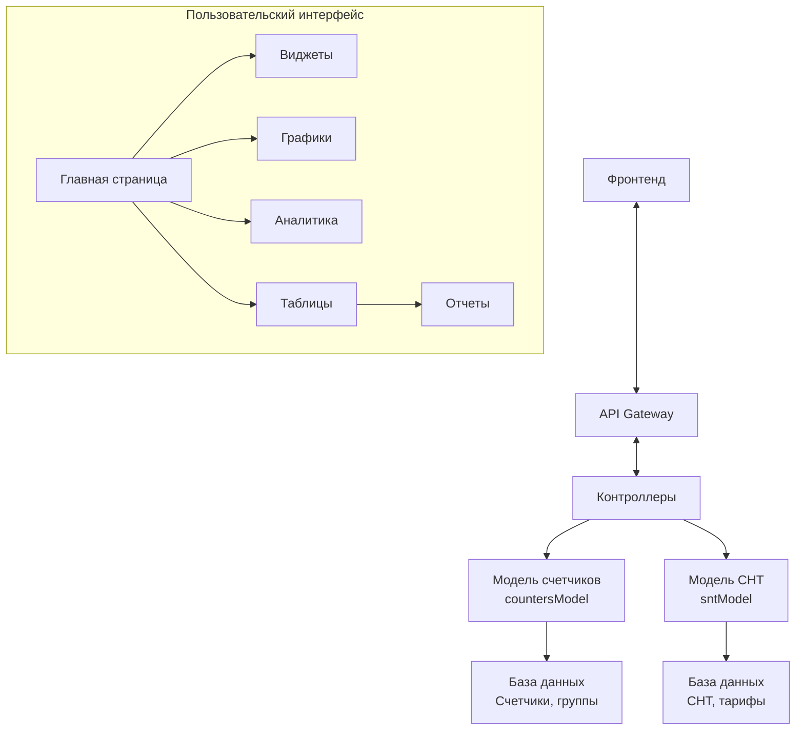
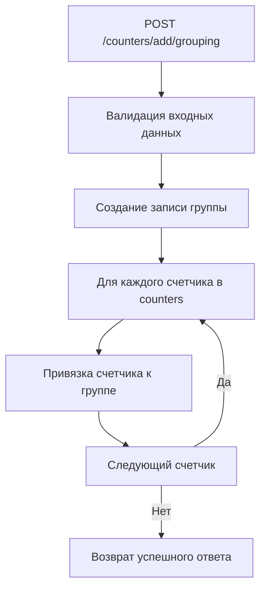
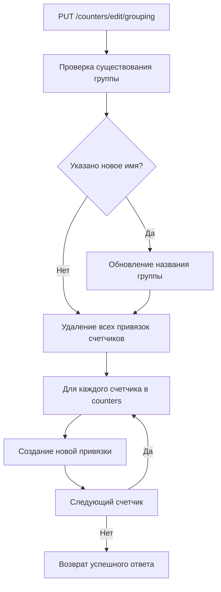
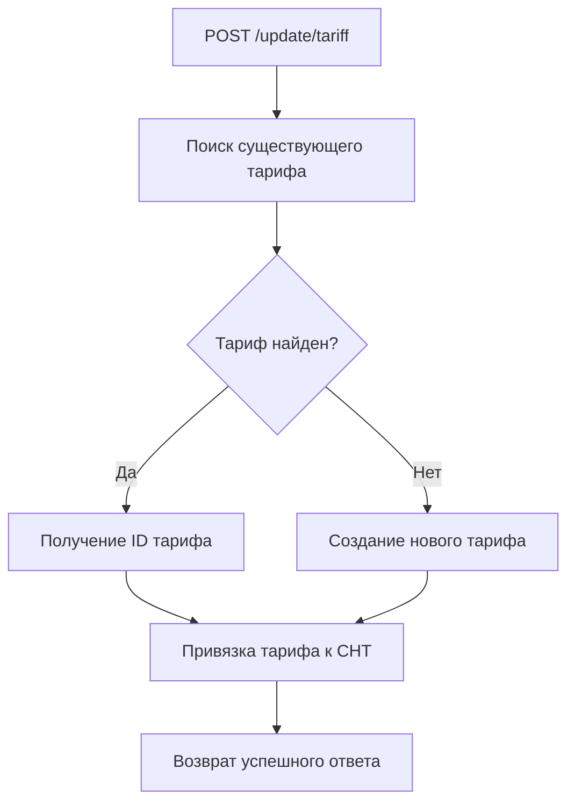
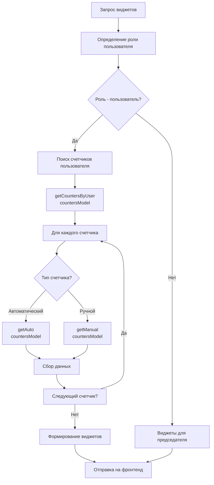
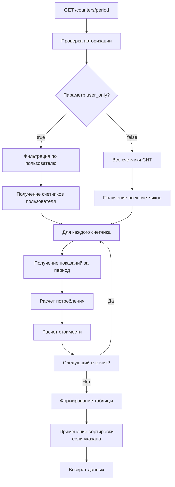

# Система управления показаниями счетчиков в садоводствах

## 📋 Оглавление
1. [Обзор системы](#обзор-системы)
2. [User Stories](#user-stories)
3. [Архитектура системы](#архитектура-системы)
4. [Группы счетчиков](#группы-счетчиков)
5. [Управление тарифами](#управление-тарифами)
6. [Виджеты](#виджеты)
7. [Графики потребления](#графики-потребления)
8. [Таблицы показаний](#таблицы-показаний)
9. [API Reference](#api-reference)
10. [Примеры использования](#примеры-использования)

---

## 🎯 Обзор системы

Система управления и визуализации данных о потреблении электроэнергии в садоводческих некоммерческих товариществах (СНТ). Платформа предоставляет инструменты для мониторинга, анализа и управления показаниями счетчиков различных типов.

### 🚀 Основные возможности
- 📊 **Группировка счетчиков** - логическое объединение счетчиков для удобства управления
- 💰 **Управление тарифами** - настройка и обновление тарифных планов для СНТ
- 🎯 **Персонализированные виджеты** - быстрый доступ к ключевым показателям
- 📈 **Аналитика потребления** - графики и диаграммы для анализа тенденций
- 📋 **Детальные отчеты** - таблицы с показаниями и потреблением за периоды
- 👥 **Мультиролевой доступ** - разные интерфейсы для председателей и пользователей

---

## 👤 User Stories

### User Story 1: Работа с группами счетчиков
**Как** администратор СНТ,  
**Я хочу** создавать, редактировать и удалять группы счетчиков,  
**Чтобы** логически группировать счетчики по улицам, районам или типам для удобства управления.

### User Story 2: Обновление тарифов для садоводства
**Как** председатель СНТ,  
**Я хочу** обновлять тарифы на электроэнергию,  
**Чтобы** правильно рассчитывать стоимость потребления для всех участков.

### User Story 3: Виджеты
**Как** пользователь системы,  
**Я хочу** видеть актуальную информацию на главной странице в виде виджетов,  
**Чтобы** быстро получать ключевые показатели без необходимости переходить в детальные разделы.

### User Story 4: Графики потребления
**Как** пользователь или администратор,  
**Я хочу** просматривать графики потребления электроэнергии,  
**Чтобы** анализировать тенденции и сравнивать потребление со средними значениями по СНТ.

### User Story 5: Таблицы показаний
**Как** пользователь или администратор,  
**Я хочу** просматривать детальные таблицы с показаниями и потреблением,  
**Чтобы** видеть полную картину потребления за выбранный период с возможностью сортировки.

---

## 🏗️ Архитектура системы

### Общая схема взаимодействия


### Структура базы данных
```
📁 Основные таблицы:
├── devices (счетчики)
│   ├── id
│   ├── eui
│   ├── group_id (СНТ)
│   ├── grouping_id (группа)
│   └── device_type
│
├── groupings (группы счетчиков)
│   ├── id
│   ├── name
│   ├── group_id (СНТ)
│   └── created_at
│
├── tariffs (тарифы)
│   ├── id
│   ├── rate_electricity_day
│   ├── rate_electricity_night
│   ├── effective_from
│   └── effective_to
│
├── snt_tariffs (привязка тарифов к СНТ)
│   ├── snt_id
│   ├── tariff_id
│   └── assigned_at
│
└── readings (показания)
    ├── device_id
    ├── reading_value
    ├── reading_date
    └── consumption
```

---

## 🏷️ Группы счетчиков (User Story 1)

### 📊 Обзор функционала
Группы счетчиков позволяют логически объединять счетчики по различным критериям (улицы, типы счетчиков, приоритетные участки и т.д.) для удобства управления и отчетности.

### 🛠️ API методы

#### 1. Получение списка групп
**Роут:** `GET /counters/get/grouping`

**Функция:** `GetGrouping(countersModel)`

**Описание:** Получение всех созданных групп счетчиков для текущего СНТ.

**Пример ответа:**
```json
{
    "success": true,
    "data": [
        {
            "id": 1,
            "name": "Центральная улица",
            "device_count": 15,
            "created_at": "2024-01-15 10:30:00",
            "created_by": "Иванов И.И."
        },
        {
            "id": 2,
            "name": "Автоматические счетчики",
            "device_count": 8,
            "created_at": "2024-01-10 14:20:00",
            "created_by": "Петров П.П."
        }
    ]
}
```

#### 2. Получение счетчиков группы
**Роут:** `GET /counters/get/grouping/devices`

**Параметры:**
- `grouping_id` (обязательный) - ID группы

**Функция:** `GetGroupingDevices(countersModel)`

**Пример запроса:**
```http
GET /counters/get/grouping/devices?grouping_id=1
```

**Пример ответа:**
```json
{
    "success": true,
    "grouping": {
        "id": 1,
        "name": "Центральная улица"
    },
    "devices": [
        {
            "device_id": 101,
            "eui": "0004A30B00219CAC",
            "plot_number": "15A",
            "owner_name": "Сидоров П.В.",
            "last_reading": 1350.8,
            "last_reading_date": "2024-01-15"
        },
        {
            "device_id": 102,
            "eui": "0004A30B00219CAD",
            "plot_number": "16Б",
            "owner_name": "Иванова М.И.",
            "last_reading": 2450.2,
            "last_reading_date": "2024-01-15"
        }
    ]
}
```

#### 3. Получение всех счетчиков с информацией о группах
**Роут:** `GET /counters/get/grouping/devices/all`

**Функция:** `GetAllDevicesForGrouping(countersModel)`

**Описание:** Получение всех счетчиков СНТ с указанием принадлежности к группам.

**Пример ответа:**
```json
{
    "success": true,
    "devices": [
        {
            "device_id": 101,
            "eui": "0004A30B00219CAC",
            "plot_number": "15A",
            "owner_name": "Сидоров П.В.",
            "groupings": [
                {
                    "grouping_id": 1,
                    "grouping_name": "Центральная улица"
                },
                {
                    "grouping_id": 2,
                    "grouping_name": "Автоматические счетчики"
                }
            ]
        },
        {
            "device_id": 103,
            "eui": "0004A30B00219CAE",
            "plot_number": "17В",
            "owner_name": "Петров А.С.",
            "groupings": [] // Не входит в группы
        }
    ]
}
```

#### 4. Создание группы счетчиков
**Роут:** `POST /counters/add/grouping`

**Параметры тела запроса:**
```json
{
    "name": "Новая группа",
    "counters": [101, 102, 103]
}
```

**Функции:**
1. `AddGrouping(countersModel)` - создание группы
2. `AddGroupingDevice(countersModel)` - привязка счетчиков

**Алгоритм работы:**


#### 5. Редактирование группы
**Роут:** `PUT /counters/edit/grouping`

**Параметры тела запроса:**
```json
{
    "grouping_id": 1,
    "name": "Обновленное название", // опционально
    "counters": [101, 104, 105] // новые счетчики
}
```

**Функции:**
1. `DeleteGroupingDevice(countersModel)` - удаление всех привязок
2. `AddGroupingDevice(countersModel)` - создание новых привязок
3. `EditGroupingName(countersModel)` - обновление названия (если передано)

**Алгоритм работы:**


#### 6. Удаление группы
**Роут:** `DELETE /counters/delete/grouping`

**Параметры:**
- `grouping_id` (обязательный) - ID группы

**Функции:**
1. `DeleteGroupingDevice(countersModel)` - удаление всех привязок счетчиков
2. `DeleteGrouping(countersModel)` - удаление группы

**Пример запроса:**
```http
DELETE /counters/delete/grouping?grouping_id=3
```

---

## 💰 Управление тарифами (User Story 2)

### 📈 Обзор функционала
Система управления тарифами на электроэнергию с поддержкой раздельных тарифов для дневного и ночного потребления.

### 🛠️ API методы

#### 1. Обновление тарифа для конкретного СНТ
**Роут:** `POST /update/tariff`

**Параметры тела запроса:**
```json
{
    "snt_id": 15,
    "rate_electricity_day": 5.80,
    "rate_electricity_night": 2.50,
    "effective_from": "2024-02-01"
}
```

**Функция:** `UpdateTariff(sntModel)`

**Алгоритм работы:**


**Пример ответа:**
```json
{
    "success": true,
    "message": "Тариф успешно обновлен",
    "tariff": {
        "id": 5,
        "rate_electricity_day": 5.80,
        "rate_electricity_night": 2.50,
        "effective_from": "2024-02-01",
        "previous_tariff_id": 4
    }
}
```

#### 2. Применение тарифа ко всем СНТ
**Роут:** `POST /set/tariff`

**Параметры тела запроса:**
```json
{
    "tariff_id": 5
}
```

**Функция:** `setTariff(sntModel)`

**Описание:** Применяет указанный тариф ко всем садоводствам в системе.

**Использование:** Для массового обновления тарифов при изменении региональных ставок.

---

## 🎯 Виджеты (User Story 3)

### 📱 Обзор функциональности
Персонализированные виджеты для разных ролей пользователей, предоставляющие быстрый доступ к ключевой информации.

### 👨‍💼 Виджеты для председателя

#### Виджет обновления тарифов
**Место:** Главная панель председателя

**Функциональность:**
- Форма ввода новых тарифных ставок
- Кнопка применения изменений
- Отображение текущего действующего тарифа

**Пример интерфейса:**
```
┌─────────────────────────────────────┐
│        Обновление тарифов           │
├─────────────────────────────────────┤
│ Текущий тариф:                      │
│ • День: 5.80 ₽/кВт·ч                │
│ • Ночь: 2.50 ₽/кВт·ч                │
│ • Действует с: 01.01.2024           │
│                                     │
│ Новый тариф:                        │
│ [ 5.95 ] ₽/кВт·ч (день)             │
│ [ 2.60 ] ₽/кВт·ч (ночь)             │
│ [ 01.02.2024 ] (с даты)             │
│                                     │
│           [ ОБНОВИТЬ ТАРИФ ]        │
└─────────────────────────────────────┘
```

### 👤 Виджеты для пользователя

#### 1. Виджет текущих тарифов
**Данные:** `GET /tariffs/current`

**Отображаемая информация:**
- Действующий тариф на день/ночь
- Дата начала действия
- Сравнение с предыдущим тарифом (если есть)

```
┌─────────────────────────────────────┐
│        Текущие тарифы               │
├─────────────────────────────────────┤
│ ⚡ Дневной тариф: 5.80 ₽/кВт·ч      │
│   (с 01.01.2024)                    │
│                                     │
│ 🌙 Ночной тариф: 2.50 ₽/кВт·ч      │
│   (с 01.01.2024)                    │
│                                     │
│ 📊 Предыдущий: 5.60 ₽/кВт·ч        │
│            (+3.6%)                  │
└─────────────────────────────────────┘
```

#### 2. Виджеты последних показаний по счетчикам
**Роут:** `GET /counters/widget`

**Алгоритм работы:**


**Пример данных для виджета показаний:**
```json
{
    "device_id": 101,
    "eui": "0004A30B00219CAC",
    "plot_number": "15А",
    "last_reading": 1350.8,
    "reading_date": "2024-01-15",
    "previous_reading": 1250.5,
    "consumption": 100.3,
    "unit": "кВт·ч"
}
```

**Визуализация виджета:**
```
┌─────────────────────────────────────┐
│ Участок 15А (Счётчик: 00219CAC)     │
├─────────────────────────────────────┤
│ 📊 Последние показания:             │
│                                     │
│ Текущие:      1350.8 кВт·ч          │
│ Предыдущие:   1250.5 кВт·ч          │
│                                     │
│ Потребление:  100.3 кВт·ч           │
│                                     │
│ Дата:         15.01.2024            │
└─────────────────────────────────────┘
```

#### 3. Виджеты потребления со сравнением
**Данные:** Среднее потребление по СНТ + индивидуальное потребление

**Пример данных:**
```json
{
    "device_id": 101,
    "personal_consumption": 100.3,
    "snt_average_consumption": 85.7,
    "difference_percent": 17.0,
    "period": "январь 2024",
    "comparison": "выше среднего"
}
```

**Визуализация виджета:**
```
┌─────────────────────────────────────┐
│ Потребление за январь 2024          │
├─────────────────────────────────────┤
│ Участок 15А:     100.3 кВт·ч        │
│                                     │
│ Среднее по СНТ:  85.7 кВт·ч         │
│                                     │
│ 📈 Ваше потребление выше            │
│    на 17.0%                         │
│                                     │
│ 💰 Примерная стоимость: 515 ₽       │
└─────────────────────────────────────┘
```

---

## 📈 Графики потребления (User Story 4)

### 📊 Обзор функциональности
Интерактивные графики для анализа потребления электроэнергии с возможностью сравнения индивидуальных показателей со средними значениями по СНТ.

### 🛠️ API методы

#### 1. График потребления для всего СНТ
**Роут:** `GET /counters/chart/group`

**Параметры:**
- `period` (опционально) - `month` или `year` (по умолчанию: `month`)
- `unit` (опционально) - `kwh` или `rub` (по умолчанию: `kwh`)
- `date` (опционально) - дата для периода (формат: `YYYY-MM` для месяца, `YYYY` для года)

**Функция:** `getChartSnt(countersModel)`

**Пример запроса:**
```http
GET /counters/chart/group?period=month&unit=kwh&date=2024-01
```

**Пример ответа:**
```json
{
    "success": true,
    "period": "month",
    "date": "2024-01",
    "unit": "kwh",
    "data": {
        "labels": ["01", "02", "03", "04", "05", "06", "07", "08", "09", "10", "11", "12", "13", "14", "15"],
        "datasets": [
            {
                "label": "Общее потребление СНТ",
                "data": [450, 480, 520, 510, 490, 530, 550, 540, 560, 570, 590, 600, 610, 620, 630],
                "borderColor": "rgb(54, 162, 235)",
                "backgroundColor": "rgba(54, 162, 235, 0.2)"
            },
            {
                "label": "Среднее потребление на участок",
                "data": [22.5, 24.0, 26.0, 25.5, 24.5, 26.5, 27.5, 27.0, 28.0, 28.5, 29.5, 30.0, 30.5, 31.0, 31.5],
                "borderColor": "rgb(255, 99, 132)",
                "backgroundColor": "rgba(255, 99, 132, 0.2)"
            }
        ]
    },
    "summary": {
        "total_consumption": 9300,
        "average_consumption": 31.0,
        "participants_count": 30,
        "total_cost": 53940.0
    }
}
```

#### 2. График потребления для конкретного счетчика
**Роут:** `GET /counters/chart/id`

**Параметры:**
- `device_id` (обязательный) - ID счетчика
- `period` (опционально) - `month` или `year`
- `unit` (опционально) - `kwh` или `rub`
- `date` (опционально) - дата для периода

**Функция:** `getChartId(countersModel)`

**Пример запроса:**
```http
GET /counters/chart/id?device_id=101&period=year&unit=rub&date=2024
```

**Пример ответа:**
```json
{
    "success": true,
    "device": {
        "device_id": 101,
        "eui": "0004A30B00219CAC",
        "plot_number": "15А",
        "owner_name": "Сидоров П.В."
    },
    "period": "year",
    "date": "2024",
    "unit": "rub",
    "data": {
        "labels": ["Янв", "Фев", "Мар", "Апр", "Май", "Июн", "Июл", "Авг", "Сен", "Окт", "Ноя", "Дек"],
        "datasets": [
            {
                "label": "Участок 15А (Сидоров П.В.)",
                "data": [515, 480, 520, 450, 420, 380, 410, 430, 490, 510, 530, 550],
                "borderColor": "rgb(75, 192, 192)",
                "backgroundColor": "rgba(75, 192, 192, 0.2)"
            },
            {
                "label": "Среднее по СНТ",
                "data": [420, 410, 430, 400, 380, 350, 370, 390, 410, 430, 450, 470],
                "borderColor": "rgb(153, 102, 255)",
                "backgroundColor": "rgba(153, 102, 255, 0.2)"
            }
        ]
    },
    "comparison": {
        "personal_total": 5685,
        "average_total": 4910,
        "difference_percent": 15.8,
        "personal_avg_month": 473.75,
        "average_avg_month": 409.17
    }
}
```
---

## 📋 Таблицы показаний и потребления (User Story 5)

### 📊 Обзор функциональности
Детальные таблицы с показаниями счетчиков, потреблением и расчетами стоимости за выбранные периоды. Поддержка сортировки по различным параметрам.

### 🛠️ API метод

#### Получение данных для таблицы
**Роут:** `GET /counters/period`

**Параметры:**
- `start_date` (обязательный) - дата начала периода (формат: `YYYY-MM-DD`)
- `end_date` (обязательный) - дата окончания периода (формат: `YYYY-MM-DD`)
- `grouping_id` (опционально) - ID группы для фильтрации
- `user_only` (опционально) - если `true`, возвращает только счетчики пользователя

**Функция:** `countersMonthPeriod(countersModel)`

**Пример запроса:**
```http
GET /counters/period?start_date=2024-01-01&end_date=2024-01-31&user_only=true
```

**Алгоритм работы:**


**Пример ответа:**
```json
{
    "success": true,
    "period": {
        "start_date": "2024-01-01",
        "end_date": "2024-01-31",
        "days_count": 31
    },
    "filters": {
        "user_only": true,
        "total_devices": 2
    },
    "data": [
        {
            "device_id": 101,
            "eui": "0004A30B00219CAC",
            "plot_number": "15А",
            "owner_name": "Сидоров Петр Васильевич",
            "device_type": "automatic",
            "readings": {
                "start": 1250.5,
                "end": 1350.8,
                "consumption": 100.3
            },
            "consumption_breakdown": {
                "day": 80.2,
                "night": 20.1,
                "total": 100.3
            },
            "cost_breakdown": {
                "day": 465.16,
                "night": 50.25,
                "total": 515.41
            },
            "tariff": {
                "day_rate": 5.80,
                "night_rate": 2.50
            }
        },
        {
            "device_id": 102,
            "eui": "0004A30B00219CAD",
            "plot_number": "16Б",
            "owner_name": "Иванова Мария Ивановна",
            "device_type": "manual",
            "readings": {
                "start": 2450.2,
                "end": 2550.7,
                "consumption": 100.5
            },
            "consumption_breakdown": {
                "day": 75.0,
                "night": 25.5,
                "total": 100.5
            },
            "cost_breakdown": {
                "day": 435.00,
                "night": 63.75,
                "total": 498.75
            },
            "tariff": {
                "day_rate": 5.80,
                "night_rate": 2.50
            }
        }
    ],
    "summary": {
        "total_consumption": 200.8,
        "total_cost": 1014.16,
        "average_consumption_per_device": 100.4,
        "average_cost_per_device": 507.08
    }
}
```

### 🎨 Фронтенд представление таблицы

#### Структура таблицы:
```
┌─────────────────────────────────────────────────────────────────────────────────────────────────────┐
│ Показания счетчиков за период: 01.01.2024 - 31.01.2024                                              │
├─────┬────────────┬──────────┬────────────┬──────────────┬─────────────┬─────────────┬───────────────┤
│ №   │ Участок    │ Счетчик  │ Показания  │ Потребление  │ День (кВт·ч)│ Ночь (кВт·ч)│ Стоимость     │
│     │            │          │ нач/кон    │ (кВт·ч)      │             │             │ (руб.)        │
├─────┼────────────┼──────────┼────────────┼──────────────┼─────────────┼─────────────┼───────────────┤
│ 1   │ 15А        │ 00219CAC │ 1250.5     │ 100.3        │ 80.2        │ 20.1        │ 515.41        │
│     │            │          │ 1350.8     │              │ (465.16)    │ (50.25)     │               │
├─────┼────────────┼──────────┼────────────┼──────────────┼─────────────┼─────────────┼───────────────┤
│ 2   │ 16Б        │ 00219CAD │ 2450.2     │ 100.5        │ 75.0        │ 25.5        │ 498.75        │
│     │            │          │ 2550.7     │              │ (435.00)    │ (63.75)     │               │
├─────┼────────────┼──────────┼────────────┼──────────────┼─────────────┼─────────────┼───────────────┤
│     │ ИТОГО:     │ 2 шт.    │            │ 200.8 кВт·ч  │ 155.2 кВт·ч │ 45.6 кВт·ч  │ 1014.16 руб.  │
└─────┴────────────┴──────────┴────────────┴──────────────┴─────────────┴─────────────┴───────────────┘
```

#### Возможности сортировки:
- По номеру участка (возрастание/убывание)
- По номеру счетчика
- По показаниям (начальным/конечным)
- По потреблению (общему/дневному/ночному)
- По стоимости

#### Фильтрация:
- По типу счетчика (автоматический/ручной)
- По принадлежности к группе
- По диапазону потребления
- По наличию задолженности

---

## 🔌 API Reference

### 📋 Сводная таблица эндпоинтов

| Метод | Роут | Назначение | Роль доступа |
|-------|------|------------|--------------|
| `GET` | `/counters/get/grouping` | Получение списка групп | Администратор |
| `GET` | `/counters/get/grouping/devices` | Счетчики группы | Администратор |
| `GET` | `/counters/get/grouping/devices/all` | Все счетчики с группами | Администратор |
| `POST` | `/counters/add/grouping` | Создание группы | Администратор |
| `PUT` | `/counters/edit/grouping` | Редактирование группы | Администратор |
| `DELETE` | `/counters/delete/grouping` | Удаление группы | Администратор |
| `POST` | `/update/tariff` | Обновление тарифа СНТ | Председатель |
| `POST` | `/set/tariff` | Применение тарифа ко всем СНТ | Администратор системы |
| `GET` | `/counters/widget` | Данные для виджетов | Все авторизованные |
| `GET` | `/counters/chart/group` | График для всего СНТ | Председатель |
| `GET` | `/counters/chart/id` | График для счетчика | Владелец/Председатель |
| `GET` | `/counters/period` | Таблица показаний за период | Все авторизованные |

### 🔐 Уровни доступа

#### 1. **Администратор системы**
- Полный доступ ко всем функциям
- Управление всеми СНТ
- Применение тарифов ко всем СНТ

#### 2. **Председатель СНТ**
- Управление группами счетчиков своего СНТ
- Обновление тарифов своего СНТ
- Просмотр графиков всего СНТ
- Доступ ко всем таблицам своего СНТ

#### 3. **Пользователь (владелец участка)**
- Просмотр своих виджетов
- Просмотр графиков своих счетчиков
- Просмотр таблиц со своими счетчиками
- Нет доступа к административным функциям

---

## 💻 Примеры использования

### Пример 1: Администратор создает группу счетчиков
```javascript
// Создание группы "Центральная улица"
async function createGrouping() {
    try {
        const response = await fetch('/counters/add/grouping', {
            method: 'POST',
            headers: {
                'Content-Type': 'application/json',
                'Authorization': `Bearer ${getToken()}`
            },
            body: JSON.stringify({
                name: 'Центральная улица',
                counters: [101, 102, 103, 104, 105]
            })
        });
        
        const result = await response.json();
        
        if (result.success) {
            console.log(`Группа создана с ID: ${result.grouping_id}`);
            showNotification('Группа успешно создана', 'success');
        } else {
            console.error('Ошибка:', result.error);
            showNotification('Ошибка создания группы', 'error');
        }
    } catch (error) {
        console.error('Сетевая ошибка:', error);
        showNotification('Ошибка соединения', 'error');
    }
}
```

### Пример 2: Пользователь просматривает графики
```javascript
// Загрузка графика потребления за месяц
async function loadMonthlyChart(deviceId) {
    showLoader('chart-container');
    
    try {
        const response = await fetch(`/counters/chart/id?device_id=${deviceId}&period=month&unit=kwh&date=2024-01`);
        const data = await response.json();
        
        if (data.success) {
            renderChart({
                type: 'line',
                data: data.data,
                options: {
                    responsive: true,
                    plugins: {
                        title: {
                            display: true,
                            text: `Потребление за январь 2024 (${data.device.plot_number})`
                        },
                        legend: {
                            position: 'top'
                        }
                    },
                    scales: {
                        y: {
                            beginAtZero: true,
                            title: {
                                display: true,
                                text: 'Потребление (кВт·ч)'
                            }
                        },
                        x: {
                            title: {
                                display: true,
                                text: 'Дни месяца'
                            }
                        }
                    }
                }
            });
        }
    } catch (error) {
        console.error('Ошибка загрузки графика:', error);
        showError('Не удалось загрузить данные графика');
    } finally {
        hideLoader('chart-container');
    }
}
```

### Пример 3: Экспорт таблицы в Excel
```javascript
// Экспорт данных таблицы
async function exportTableToExcel(startDate, endDate) {
    try {
        // Получение данных
        const response = await fetch(`/counters/period?start_date=${startDate}&end_date=${endDate}`);
        const data = await response.json();
        
        if (!data.success) {
            throw new Error('Не удалось получить данные');
        }
        
        // Формирование Excel файла
        const workbook = new ExcelJS.Workbook();
        const worksheet = workbook.addWorksheet('Показания');
        
        // Заголовки
        worksheet.columns = [
            { header: 'Участок', key: 'plot', width: 10 },
            { header: 'Счетчик', key: 'eui', width: 15 },
            { header: 'Владелец', key: 'owner', width: 25 },
            { header: 'Начальные показания', key: 'start', width: 15 },
            { header: 'Конечные показания', key: 'end', width: 15 },
            { header: 'Потребление (кВт·ч)', key: 'consumption', width: 15 },
            { header: 'Стоимость (руб.)', key: 'cost', width: 15 }
        ];
        
        // Данные
        data.data.forEach(item => {
            worksheet.addRow({
                plot: item.plot_number,
                eui: item.eui,
                owner: item.owner_name,
                start: item.readings.start,
                end: item.readings.end,
                consumption: item.readings.consumption,
                cost: item.cost_breakdown.total
            });
        });
        
        // Сохранение файла
        const buffer = await workbook.xlsx.writeBuffer();
        const blob = new Blob([buffer], { type: 'application/vnd.openxmlformats-officedocument.spreadsheetml.sheet' });
        saveAs(blob, `показания_${startDate}_${endDate}.xlsx`);
        
    } catch (error) {
        console.error('Ошибка экспорта:', error);
        showError('Не удалось экспортировать данные');
    }
}
```

---

## 🐛 Отладка и мониторинг

### Логирование операций
```javascript
// Структура лога операций
const operationLog = {
    timestamp: new Date().toISOString(),
    operation: 'grouping_creation',
    user_id: currentUser.id,
    user_role: currentUser.role,
    parameters: {
        grouping_name: 'Центральная улица',
        device_count: 5,
        device_ids: [101, 102, 103, 104, 105]
    },
    result: 'success',
    execution_time: '0.45s',
    ip_address: clientIP,
    user_agent: navigator.userAgent
};
```

### Мониторинг производительности
- **Время ответа API**: Среднее время выполнения запросов
- **Частота использования**: Популярность различных эндпоинтов
- **Ошибки**: Статистика ошибок по типам
- **Активность пользователей**: Количество активных сессий

---

## 🔒 Безопасность

### Меры безопасности
1. **Авторизация**: JWT токены для всех API запросов
2. **Валидация данных**: Проверка всех входных параметров
3. **SQL инъекции**: Использование подготовленных запросов
4. **XSS защита**: Экранирование вывода данных
5. **Ограничение запросов**: Rate limiting для API
6. **Аудит действий**: Логирование всех значимых операций

### Контроль доступа
```javascript
// Пример middleware проверки ролей
function checkRole(allowedRoles) {
    return (req, res, next) => {
        const userRole = req.user.role;
        
        if (!allowedRoles.includes(userRole)) {
            return res.status(403).json({
                success: false,
                error: 'Доступ запрещен. Недостаточно прав.'
            });
        }
        
        next();
    };
}

// Использование
app.get('/counters/get/grouping', 
    authenticateToken,
    checkRole(['admin', 'chairman']),
    getGroupingController
);
```

---

## 📞 Поддержка

### Частые проблемы и решения

#### 1. "Нет доступа к созданию групп"
- **Причина**: Пользователь не имеет роли администратора или председателя
- **Решение**: Проверить роль пользователя в системе

#### 2. "График не отображается"
- **Причина**: Нет данных за указанный период
- **Решение**: Проверить наличие показаний счетчиков за период

#### 3. "Ошибка при обновлении тарифа"
- **Причина**: Неверный формат даты или тарифных ставок
- **Решение**: Проверить формат входных данных


---

*Документация обновлена: 2025-07-08*  
*Версия системы: 3.0.0*  
*Последние изменения: Добавлены интерактивные графики, улучшена производительность таблиц*