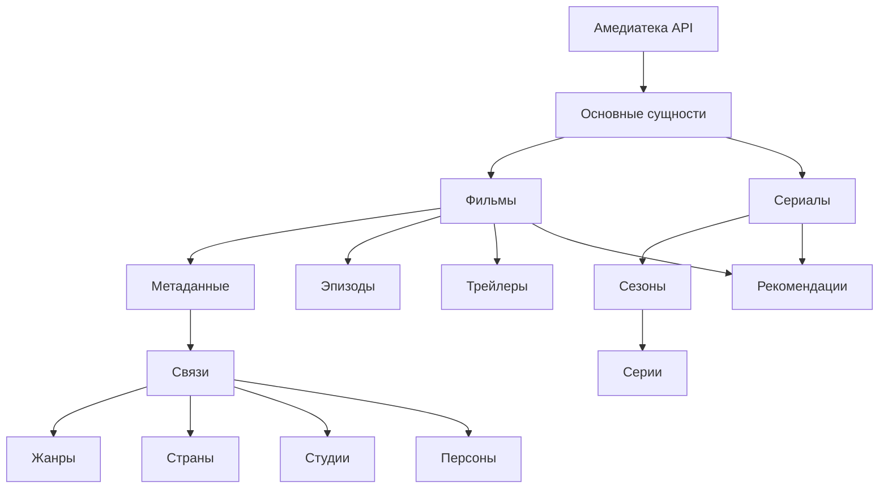
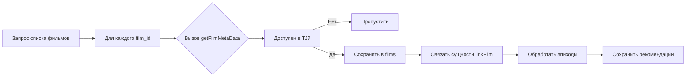
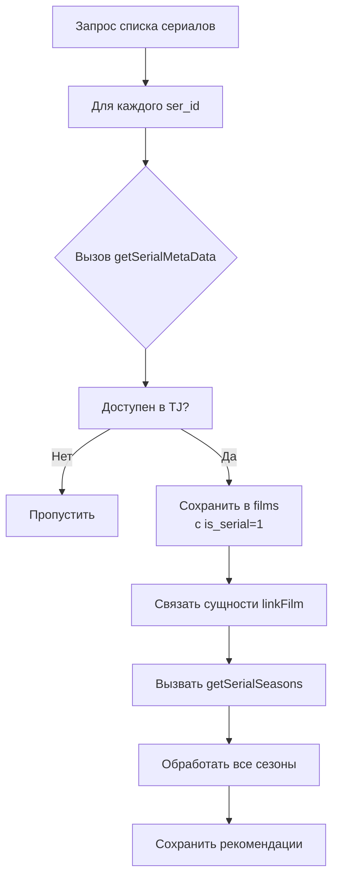
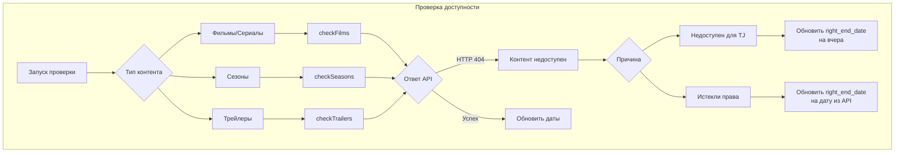

# Система управления контентом Амедиатеки

## 📋 Оглавление
1. [Обзор системы](#обзор-системы)
2. [Архитектура и расписание](#архитектура-и-расписание)
3. [Сбор данных о контенте](#сбор-данных-о-контенте)
4. [Мониторинг доступности](#мониторинг-доступности)
5. [Технические детали](#технические-детали)

---

## 🎯 Обзор системы

### Цель системы
Автоматизированное получение, хранение и поддержание актуальности данных о видео-контенте с платформы Амедиатека для региона Таджикистан (TJ).

### Ключевые возможности
- 📥 Получение полных метаданных фильмов и сериалов
- 🏗️ Обработка иерархической структуры (сериалы → сезоны → серии)
- 🔄 Регулярная проверка доступности контента
- 🏷️ Связывание контента с сущностями (жанры, страны, студии, персоны)
- ⚠️ Обнаружение и обработка недоступного контента

---

## ⏰ Архитектура и расписание

### Расписание выполнения задач

| Задача | Файл | Расписание (Cron) | Описание | Время выполнения |
|--------|------|-------------------|----------|------------------|
| **Полный сбор данных** | `getAllInfo` | `0 1 * * *` | Ежедневный сбор всех данных | 01:00 ночи |
| **Проверка фильмов/сериалов** | `checkFilms` | `15 */3 * * *` | Каждые 3 часа | :15, 3:15, 6:15... |
| **Проверка сезонов** | `checkSeasons` | `30 */3 * * *` | Каждые 3 часа | :30, 3:30, 6:30... |
| **Проверка трейлеров** | `checkTrailers` | `45 */3 * * *` | Каждые 3 часа | :45, 3:45, 6:45... |

### 📊 Структура данных контента



---

## 🔍 Сбор данных о контенте (Job Story 1)

### 🔑 Аутентификация в API

| Параметр | Тип | Описание | Пример |
|----------|-----|----------|--------|
| `PLATFORM` | string | API-name для доступа | `partner_platform_name` |
| `PRIVATEKEY` | string | API-ключ для доступа | `a1b2c3d4e5f6...` |

### 📚 Основные справочники

#### 1. Получение студий (`getStudios`)
**Цель:** Заполнение справочника студий-производителей

```php
// Пример запроса
GET $_ENV['URL']."/studios?catalogue_type=movies"
```

**Структура ответа:**
```json
{
  "studios": [
    {
      "id": 123,
      "name": "Warner Bros.",
      "description": "Американская кинокомпания"
    }
  ]
}
```

**Таблица хранения: `studios`**
| Поле | Тип | Описание |
|------|-----|----------|
| `id` | INT | Первичный ключ |
| `amedia_id` | INT | ID из Амедиатеки |
| `studio_name` | VARCHAR(255) | Название студии |
| `created_at` | TIMESTAMP | Дата создания |

#### 2. Получение стран (`getCountries`)
**Цель:** Заполнение справочника стран производства

```php
// Пример запроса
GET $_ENV['URL']."/countries?catalogue_type=series"
```

**Таблица хранения: `countries`**
| Поле | Тип | Описание |
|------|-----|----------|
| `id` | INT | Первичный ключ |
| `amedia_id` | INT | ID из Амедиатеки |
| `country_name` | VARCHAR(100) | Название страны |
| `country_code` | CHAR(2) | Код страны (опционально) |

#### 3. Получение жанров (`getGenres`)
**Цель:** Заполнение справочника жанров

```php
// Пример запроса
GET $_ENV['URL']."/genres?catalogue_type=movies"
```

**Таблица хранения: `genres`**
| Поле | Тип | Описание |
|------|-----|----------|
| `id` | INT | Первичный ключ |
| `amedia_id` | INT | ID из Амедиатеки |
| `genre_name` | VARCHAR(100) | Название жанра |
| `category` | VARCHAR(50) | Категория (фильм/сериал) |

### 🎬 Обработка фильмов

#### Функция `getFilms()`
**Алгоритм работы:**


#### Функция `getFilmMetaData(film_id)`
**Получение полных метаданных фильма**

**Параметры:**
| Параметр | Тип | Обязательный | Описание |
|----------|-----|--------------|----------|
| `film_id` | INT | Да | Идентификатор фильма в Амедиатеке |

**Возвращаемое значение:**
```php
[
    'metadata' => [
        'film_id' => 12345,
        'film_name' => 'Интерстеллар',
        'film_name_original' => 'Interstellar',
        'year' => 2014,
        'age_rating' => '12+',
        'ratingKinopoisk' => 8.6,
        'ratingImdb' => 8.6,
        'ratingAmedia' => 9.1,
        'description' => 'Фильм о путешествиях...',
        // ... другие поля
    ],
    'other_info' => [
        'countries' => [['id' => 1, 'name' => 'США']],
        'genres' => [['id' => 5, 'name' => 'Фантастика']],
        'studios' => [['id' => 12, 'name' => 'Warner Bros.']],
        'persons' => [
            ['id' => 101, 'name' => 'Кристофер Нолан', 'type' => 'director']
        ]
    ]
]
```

**Обрабатываемые данные:**
- ✅ Основные метаданные
- ✅ Изображения (постеры, баннеры)
- ✅ Рейтинги (Кинопоиск, IMDb, Амедиатека)
- ✅ Трейлеры
- ✅ Эпизоды (для многосерийных фильмов)
- ✅ Рекомендации

### 📺 Обработка сериалов

#### Функция `getSerials()`
**Алгоритм работы:**


#### Функция `getSerialMetaData(ser_id)`
**Возвращаемая структура:**
```php
[
    'metadata' => [
        'film_id' => 67890,
        'film_name' => 'Игра престолов',
        'is_serial' => 1,
        // ... другие метаданные
    ],
    'seasons' => [
        [
            'id' => 111,
            'title' => 'Первый сезон',
            'seasonNumber' => 1,
            'episodeCount' => 10
        ]
    ],
    'other_info' => [
        // страны, жанры, студии, персоны
    ]
]
```

#### Функция `getSerialSeasons(ser_id, seasons)`
**Обработка иерархии сериала:**

```php
// Входные данные
$seasons = [
    [
        'id' => 111,
        'title' => 'Первый сезон',
        'seasonNumber' => 1,
        'episodeCount' => 10
    ]
];

// Для каждого сезона:
// 1. Получить метаданные сезона
// 2. Сохранить в таблицу seasons
// 3. Обработать эпизоды (сохранить в series)
```

**Таблицы для хранения:**
- `seasons` - метаданные сезонов
- `series` - информация о сериях

### 🔗 Связывание сущностей

#### Функция `linkFilm(film_id, info)`
**Назначение:** Создание связей между фильмом и связанными сущностями

**Входные данные:**
```php
$info = [
    'genres' => [
        ['id' => 5, 'name' => 'Фантастика']
    ],
    'countries' => [
        ['id' => 1, 'name' => 'США']
    ],
    'studios' => [
        ['id' => 12, 'name' => 'Warner Bros.']
    ],
    'persons' => [
        [
            'id' => 101,
            'name' => 'Кристофер Нолан',
            'type' => 'director',
            'role' => 'Режиссер'
        ]
    ]
];
```

**Создаваемые связи:**
| Связь | Таблица | Описание |
|-------|---------|----------|
| Фильм-Жанр | `films_genres` | Многие-ко-многим |
| Фильм-Страна | `films_countries` | Многие-ко-многим |
| Фильм-Студия | `films_studios` | Многие-ко-многим |
| Фильм-Персона | `films_persons` | Многие-ко-многим с типом роли |

---

## 🔄 Мониторинг доступности (Job Story 2)

### 📊 Общая схема мониторинга



### 🎞️ Проверка фильмов/сериалов (`checkFilms`)

**Описание**
Партнёр в случае истекших прав отдаёт 404 ошибку при обращении к элементу контента, поэтому необходима проверка доступности

**Алгоритм:**
1. **Получить список** всех активных фильмов из таблицы `films`
2. **Для каждого фильма:**
   - Отправить запрос к API Амедиатеки
   - Проверить наличие ответа
   - Проверить наличие прав для региона TJ в ответе   
3. **Обновить данные:**
   ```sql
   -- Если недоступен для TJ или 404 в ответе
   UPDATE films SET right_end_date = DATE_SUB(NOW(), INTERVAL 1 DAY)
   WHERE film_id = :film_id;
   
   -- Если есть дата окончания прав
   UPDATE films SET right_end_date = :api_end_date
   WHERE film_id = :film_id;
   
   -- Обновить описание если требуется
   UPDATE films SET info_text = :new_description
   WHERE film_id = :film_id AND update_description = 1;
   ```

**Обрабатываемые сценарии:**
- ✅ Контент доступен - обновить `right_end_date` из API
- ❌ Контент недоступен для TJ - установить `right_end_date = вчера`
- ❌ Истекли права (404) - установить `right_end_date` из API

### 📅 Проверка сезонов (`checkSeasons`)

**Отличия от `checkFilms`:**
- Работает с таблицей `seasons`
- Обновляет поле `season_info` вместо `info_text`
- Проверяет доступность каждого сезона отдельно

### 🎥 Проверка трейлеров (`checkTrailers`)

**Алгоритм:**
1. **Получить список** фильмов с непустым полем `trailer`
2. **Для каждого фильма:**
   - Проверить доступность трейлера через API
   - Если трейлер отсутствует в API - установить `trailer = NULL`
3. **Обновить базу:**
   ```sql
   UPDATE films 
   SET trailer = NULL 
   WHERE film_id = :film_id 
   ```

---

## 🛠️ Технические детали

### 🗄️ Структура основных таблиц

#### Таблица `films`
| Поле | Тип | Описание | Индекс |
|------|-----|----------|--------|
| `id` | INT | Первичный ключ | PRIMARY |
| `film_id` | INT | ID из Амедиатеки | UNIQUE |
| `film_name` | VARCHAR(255) | Название | INDEX |
| `film_name_original` | VARCHAR(255) | Оригинальное название | |
| `is_serial` | TINYINT(1) | Флаг сериала (0/1) | INDEX |
| `right_end_date` | DATE | Дата окончания прав | INDEX |
| `trailer` | TEXT | Ссылка на трейлер | |
| `update_description` | TINYINT(1) | Флаг обновления описания | |
| `description` | TEXT | Описание контента | |
| `created_at` | TIMESTAMP | Дата создания | |
| `updated_at` | TIMESTAMP | Дата обновления | |

#### Таблица `seasons`
| Поле | Тип | Описание | Индекс |
|------|-----|----------|--------|
| `id` | INT | Первичный ключ | PRIMARY |
| `season_id` | INT | ID из Амедиатеки | UNIQUE |
| `film_id` | INT | Ссылка на фильм | FOREIGN KEY |
| `season_number` | INT | Номер сезона | INDEX |
| `season_info` | TEXT | Описание сезона | |
| `right_end_date` | DATE | Дата окончания прав | |
| `update_description` | TINYINT(1) | Флаг обновления | |

### ⚠️ Обработка ошибок

#### Типы ошибок API:
1. **HTTP 404** - контент не найден
   - Действие: пометить как недоступный
   
2. **HTTP 403** - доступ запрещен
   - Действие: проверить региональные ограничения
   
3. **HTTP 500** - ошибка сервера
   - Действие: повторить попытку через 5 минут
   
4. **Таймаут соединения**
   - Действие: повторить попытку (макс. 3 раза)

#### Логирование:
```php
// Структура лога
$logEntry = [
    'timestamp' => date('Y-m-d H:i:s'),
    'operation' => 'checkFilms',
    'film_id' => $filmId,
    'status' => $status,
    'http_code' => $httpCode,
    'response_time' => $responseTime,
    'error_message' => $errorMessage ?? null
];
```

### 📈 Метрики и мониторинг

**Ключевые метрики:**
1. **Процент доступного контента:**
   ```
   (доступные_фильмы / все_фильмы) * 100
   ```

2. **Время отклика API:**
   - Среднее время ответа
   - 95-й перцентиль
   - Максимальное время

3. **Частота обновлений:**
   - Количество обновленных записей в час
   - Процент изменений после проверки

**Алерты:**
- ⚠️ Более 10% контента стало недоступным
- ⚠️ Среднее время ответа API > 2 секунд
- ⚠️ Количество ошибок 404 > 100 в час

---

## 📋 Чек-лист развертывания

### Предварительные требования
-  Доступ к API Амедиатеки (PLATFORM, PRIVATEKEY)
-  MySQL 5.7+ или PostgreSQL 10+
-  PHP 7.4+ с расширениями: curl, json, pdo
-  Настроенный cron (или альтернативный планировщик)
-  10GB+ свободного места на диске

### Настройка базы данных
```sql
-- Основные таблицы должны быть созданы
-- Индексы должны быть настроены
-- Пользователь БД должен иметь права на SELECT, INSERT, UPDATE, DELETE
```

### Тестирование
1.  Проверить подключение к API
2.  Запустить `getAllInfo` в тестовом режиме
3.  Проверить заполнение таблиц `films`, `genres`, `countries`, `studios`
4.  Запустить `checkFilms` для нескольких тестовых записей
5.  Проверить логи на наличие ошибок

### Мониторинг после запуска
-  Проверить выполнение по расписанию
-  Убедиться в обновлении `right_end_date`
-  Проверить логи на наличие предупреждений
-  
---


## Частые проблемы

1. **API возвращает 403**
   - Проверить корректность PLATFORM и PRIVATEKEY
   - Проверить срок действия ключей
   - Убедиться в доступе для региона TJ

2. **Медленная работа скриптов**
   - Проверить индексы в базе данных
   - Оптимизировать запросы (LIMIT, OFFSET)
   - Рассмотреть увеличение времени выполнения скрипта

3. **Пропуски в расписании**
   - Проверить настройки cron
   - Проверить доступность сервера в время выполнения
   - Проверить логи на наличие фатальных ошибок


---

*Документация обновлена: 2024-01-15*  
*Версия системы: 2.1.0*  
*Последние изменения: Добавлена проверка трейлеров, оптимизированы запросы к API*
