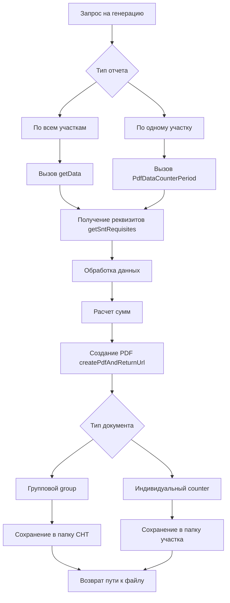
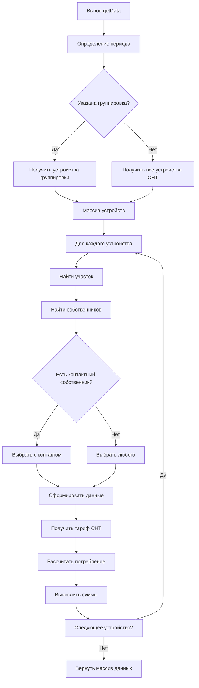
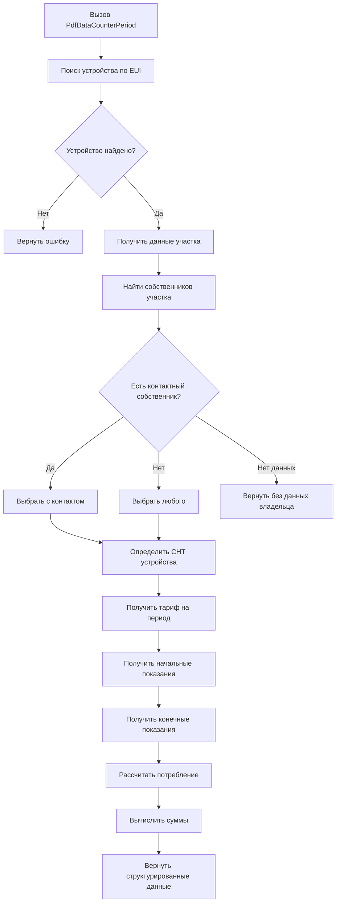
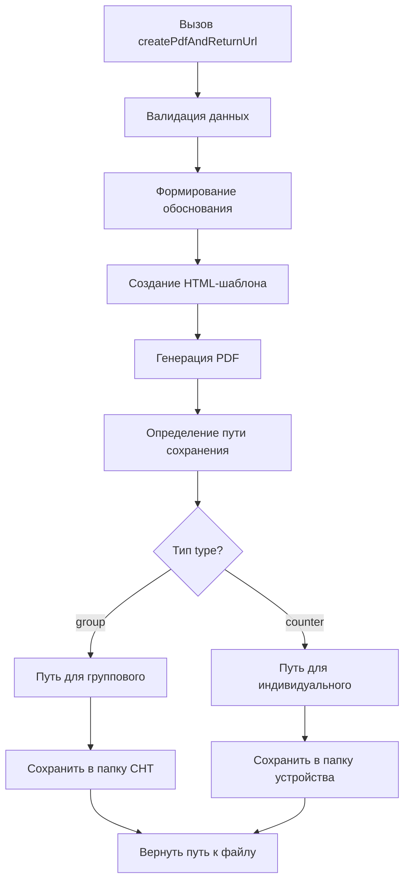

# Система генерации PDF-документов для садоводческих товариществ

## 📋 Оглавление
1. [Обзор системы](#обзор-системы)
2. [Архитектура системы](#архитектура-системы)
3. [Методы работы с данными](#методы-работы-с-данными)
4. [Генерация PDF](#генерация-pdf)
5. [Структуры данных](#структуры-данных)
6. [Примеры использования](#примеры-использования)

---

## 🎯 Обзор системы

### Назначение системы
Генерация PDF-документов для садоводческих некоммерческих товариществ (СНТ), включая квитанции на оплату, отчеты о потреблении и финансовые документы.

### Основные возможности
- 📄 Генерация квитанций для отдельных участков
- 📊 Формирование сводных отчетов по СНТ
- 🧾 Подготовка обоснований для платежей
- 💾 Автоматическое сохранение документов
- 🔢 Расчет потребления и сумм к оплате

---

## 🏗️ Архитектура системы

### Общая схема работы


### 📁 Структура хранения файлов
```
pdf_documents/
├── snt_{id}/                    # Папка садоводства
│   ├── group/                   # Групповые отчеты
│   │   ├── 2024-01/            # Отчеты по месяцам
│   │   │   ├── report_2024-01.pdf
│   │   │   └── receipt_2024-01.pdf
│   │   └── ...
│   └── counters/               # Индивидуальные квитанции
│       ├── {eui}/              # По устройствам
│       │   ├── 2024-01/
│       │   │   └── receipt.pdf
│       │   └── ...
│       └── ...
└── ...
```

---

## 📊 Методы работы с данными

### 1. Получение реквизитов садоводства

#### Функция `getSntRequisites(id)`

**Назначение:** Получение банковских и юридических реквизитов СНТ для формирования платежных документов.

**Параметры:**
| Параметр | Тип | Обязателен | Описание | Пример |
|----------|-----|------------|----------|--------|
| `id` | `int` | Да | Идентификатор садоводства в системе | `15` |

**Структура возвращаемых данных:**
```php
{
  "snt_id": 15,
  "name": "СНТ 'Берёзка'",
  "legal_address": "г. Москва, ул. Садовая, д. 1",
  "inn": "7701234567",
  "kpp": "770101001",
  "bank_name": "ПАО 'Сбербанк'",
  "bik": "044525225",
  "correspondent_account": "30101810400000000225",
  "settlement_account": "40702810200000012345",
  "director": "Иванов Иван Иванович",
  "accountant": "Петрова Мария Сергеевна",
  "phone": "+7 (495) 123-45-67",
  "email": "snt-berezka@example.com"
}
```

**Пример использования:**
```php
$requisites = getSntRequisites(15);
echo $requisites['bank_name']; // ПАО 'Сбербанк'
```

---

### 2. Получение данных по всем участкам за месяц

#### Функция `getData(group, grouping = null, offset = 0)`

**Назначение:** Сбор и обработка данных по всем участкам СНТ за указанный период для формирования сводного отчета.

**Параметры:**
| Параметр | Тип | Обязателен | Описание | По умолчанию | Пример |
|----------|-----|------------|----------|--------------|--------|
| `group` | `int` | Да | ID садоводства | - | `15` |
| `grouping` | `int` | Нет | ID группировки участков | `null` | `3` |
| `offset` | `int` | Нет | Смещение в месяцах от текущего | `0` | `-1` (прошлый месяц) |

#### 🚀 Алгоритм работы



**Шаги выполнения:**

1. **Определение периода расчета:**
   ```php
   // Пример для offset = -1 (прошлый месяц)
   $currentDate = new DateTime();
   $currentDate->modify('-1 month');
   $startDate = new DateTime($currentDate->format('Y-m-01'));
   $endDate = new DateTime($currentDate->format('Y-m-t'));
   ```

2. **Формирование списка устройств:**
   ```sql
   -- Если указана группировка
   SELECT device_id, eui FROM devices 
   WHERE group_id = :group AND grouping_id = :grouping
   
   -- Без группировки
   SELECT device_id, eui FROM devices 
   WHERE group_id = :group
   ```

3. **Сбор данных пользователей:**
   ```sql
   SELECT 
       u.user_id,
       u.full_name,
       u.phone,
       u.email,
       p.plot_number,
       p.address
   FROM plot_owners po
   JOIN users u ON po.user_id = u.user_id
   JOIN plots p ON po.plot_id = p.plot_id
   WHERE p.device_id = :device_id   
   LIMIT 1
   ```

4. **Получение тарифа:**
   ```sql
   SELECT 
       tariff_id,
       rate_electricity_day,
       rate_electricity_night
   FROM tariffs
   WHERE group_id = :group     
   LIMIT 1
   ```

5. **Расчет показаний и сумм:**
   ```sql
   -- Получение начальных показаний
   SELECT reading_value 
   FROM meter_readings 
   WHERE device_id = :device_id 
     AND reading_date <= :start_date
   ORDER BY reading_date DESC 
   LIMIT 1
   
   -- Получение конечных показаний
   SELECT reading_value 
   FROM meter_readings 
   WHERE device_id = :device_id 
     AND reading_date <= :end_date
   ORDER BY reading_date DESC 
   LIMIT 1
   
   -- Расчет потребления
   SELECT 
       SUM(consumption_electricity_day) as day,
       SUM(consumption_electricity_night) as night
   FROM consumption_data
   WHERE device_id = :device_id
     AND consumption_date BETWEEN :start_date AND :end_date
   ```

**Пример возвращаемых данных:**
```php
[
    [
        'device' => [
            'device_id' => 101,
            'eui' => '0004A30B00219CAC',
            'type' => 'electricity_meter'
        ],
        'plot' => [
            'plot_id' => 25,
            'plot_number' => '15A',
            'address' => 'ул. Садовая, участок 15А',
            'area' => 600
        ],
        'owner' => [
            'user_id' => 42,
            'full_name' => 'Сидоров Петр Васильевич',
            'phone' => '+7 (916) 123-45-67',
            'email' => 'sidorov@example.com'
        ],
        'period' => [
            'start_date' => '2024-01-01',
            'end_date' => '2024-01-31',
            'month_name' => 'Январь 2024'
        ],
        'readings' => [
            'start' => 1250.5,
            'end' => 1350.8,
            'consumption' => 100.3,
            'reset_date' => null // или дата обнуления
        ],
        'tariff' => [
            'tariff_id' => 5,
            'rate_electricity_day' => 5.80,
            'rate_electricity_night' => 2.50
        ],
        'calculations' => [
            'electricity_day' => [
                'consumption' => 80.2,
                'rate' => 5.80,
                'amount' => 465.16
            ],
            'electricity_night' => [
                'consumption' => 20.1,
                'rate' => 2.50,
                'amount' => 50.25
            ],
            'total_amount' => 515.41
        ]
    ],
    // ... другие участки
]
```

---

### 3. Получение данных по конкретному участку за период

#### Функция `PdfDataCounterPeriod(eui, from, to)`

**Назначение:** Получение детализированных данных по одному участку/устройству за произвольный период для формирования индивидуальной квитанции.

**Параметры:**
| Параметр | Тип | Обязателен | Описание | Пример |
|----------|-----|------------|----------|--------|
| `eui` | `string` | Да | Серийный номер счетчика | `'0004A30B00219CAC'` |
| `from` | `date` | Да | Дата начала периода | `'2024-01-01'` |
| `to` | `date` | Да | Дата окончания периода | `'2024-01-31'` |

#### 🔍 Алгоритм работы



**Пример использования:**
```php
$data = PdfDataCounterPeriod(
    eui: '0004A30B00219CAC',
    from: '2024-01-01',
    to: '2024-01-31'
);

// Структура ответа аналогична getData,
// но для одного устройства
```

---

## 🖨️ Генерация PDF

### Функция `createPdfAndReturnUrl(item, type)`

**Назначение:** Создание PDF-документа на основе подготовленных данных с автоматическим сохранением в файловой системе.

**Параметры:**
| Параметр | Тип | Обязателен | Описание | Пример |
|----------|-----|------------|----------|--------|
| `item` | `array` | Да | Массив данных устройства/участка | `$data[0]` |
| `type` | `string` | Да | Тип документа:<br>`'group'` - групповой<br>`'counter'` - индивидуальный | `'counter'` |

#### 📝 Алгоритм работы



#### 1. Формирование обоснования


**Для индивидуальных квитанций:**
```
Квитанция на оплату электроэнергии
за период с 01.01.2024 по 31.01.2024
Участок №15А, собственник: Сидоров П.В.
Сумма к оплате: 515,41 руб.
```

#### 2. Определение путей сохранения

```php
// Для type = 'group'
$basePath = "pdf_documents/snt_{$sntId}/group/";
$yearMonth = date('Y-m', strtotime($period['end_date']));
$fileName = "receipt_{$yearMonth}.pdf";
$filePath = $basePath . $yearMonth . '/' . $fileName;

// Для type = 'counter'
$basePath = "pdf_documents/snt_{$sntId}/counters/{$eui}/";
$yearMonth = date('Y-m', strtotime($period['end_date']));
$fileName = "receipt_{$yearMonth}.pdf";
$filePath = $basePath . $yearMonth . '/' . $fileName;
```

#### 3. Структура PDF-документа

**Заголовок:**
- Название СНТ
- Тип документа (квитанция/отчет)
- Период действия
- Дата формирования

**Реквизиты получателя:**
- Полное наименование СНТ
- Юридический адрес
- ИНН/КПП
- Банковские реквизиты

**Данные плательщика:**
- ФИО собственника
- Номер участка
- Адрес участка
- Контактные данные

**Таблица потребления электроэнергии:**
| Услуга | Показания на начало | Показания на конец | Расход | Тариф | Сумма |
|--------|---------------------|--------------------|--------|-------|-------|
| Электричество день | 1250.5 кВт·ч | 1330.7 кВт·ч | 80.2 кВт·ч | 5.80 ₽ | 465.16 ₽ |
| Электричество ночь | 150.3 кВт·ч | 170.4 кВт·ч | 20.1 кВт·ч | 2.50 ₽ | 50.25 ₽ |
| **Итого** | | | | | **515.41 ₽** |

**Итоговая информация:**
- Общая сумма к оплате
- Срок оплаты
- Реквизиты для оплаты
- QR-код для быстрой оплаты

**Возвращаемое значение:**
```php
// Успешное выполнение
[
    'success' => true,
    'file_path' => '/var/www/pdf_documents/snt_15/counters/0004A30B00219CAC/2024-01/receipt.pdf',
    'file_url' => 'https://example.com/pdf/snt_15/counters/0004A30B00219CAC/2024-01/receipt.pdf',
    'file_size' => 145678, // в байтах
    'created_at' => '2024-01-15 14:30:25'
]

// Ошибка
[
    'success' => false,
    'error' => 'Не удалось создать PDF документ',
    'error_code' => 'PDF_GENERATION_FAILED'
]
```

---

## 🗄️ Структуры данных

### Таблица `snt` (садоводства)
| Поле | Тип | Описание | Пример |
|------|-----|----------|--------|
| `id` | INT | Первичный ключ | `15` |
| `name` | VARCHAR(255) | Название СНТ | `СНТ "Березка"` |
| `legal_address` | TEXT | Юридический адрес | `г. Москва, ул. Садовая, д. 1` |
| `inn` | VARCHAR(12) | ИНН | `7701234567` |
| `kpp` | VARCHAR(9) | КПП | `770101001` |
| `bank_name` | VARCHAR(255) | Название банка | `ПАО "Сбербанк"` |
| `bik` | VARCHAR(9) | БИК | `044525225` |
| `correspondent_account` | VARCHAR(20) | Корр. счет | `30101810400000000225` |
| `settlement_account` | VARCHAR(20) | Расчетный счет | `40702810200000012345` |
| `director` | VARCHAR(255) | Председатель | `Иванов И.И.` |

### Таблица `devices` (устройства)
| Поле | Тип | Описание | Пример |
|------|-----|----------|--------|
| `device_id` | INT | Первичный ключ | `101` |
| `eui` | VARCHAR(16) | Серийный номер | `0004A30B00219CAC` |
| `group_id` | INT | Ссылка на СНТ | `15` |
| `device_type` | ENUM | Тип устройства | `'electricity'` |
| `installation_date` | DATE | Дата установки | `2023-05-15` |

### Таблица `plots` (участки)
| Поле | Тип | Описание | Пример |
|------|-----|----------|--------|
| `plot_id` | INT | Первичный ключ | `25` |
| `plot_number` | VARCHAR(10) | Номер участка | `15A` |
| `device_id` | INT | Ссылка на устройство | `101` |
| `area` | DECIMAL(8,2) | Площадь (м²) | `600.00` |
| `address` | VARCHAR(255) | Адрес участка | `ул. Садовая, участок 15А` |

### Таблица `tariffs` (тарифы)
| Поле | Тип | Описание | Пример |
|------|-----|----------|--------|
| `tariff_id` | INT | Первичный ключ | `5` |
| `group_id` | INT | Ссылка на СНТ | `15` |
| `rate_electricity_day` | DECIMAL(10,4) | Тариф день | `5.8000` |
| `rate_electricity_night` | DECIMAL(10,4) | Тариф ночь | `2.5000` |
| `effective_from` | DATE | Начало действия | `2024-01-01` |
| `effective_to` | DATE | Окончание действия | `NULL` |

---

## 📖 Примеры использования

### Пример 1: Генерация отчетов за прошлый месяц

```php
// 1. Получение реквизитов СНТ
$requisites = getSntRequisites(15);

// 2. Получение данных по всем участкам
$allPlotsData = getData(
    group: 15,
    grouping: null, // Все участки
    offset: -1      // Прошлый месяц
);

// 3. Создание группового отчета
foreach ($allPlotsData as $plotData) {
    $pdfResult = createPdfAndReturnUrl(
        item: $plotData,
        type: 'group'
    );
    
    if ($pdfResult['success']) {
        echo "Создан PDF: " . $pdfResult['file_url'] . "\n";
    }
}
```

### Пример 2: Генерация квитанции для конкретного участка

```php
// 1. Получение данных за произвольный период
$plotData = PdfDataCounterPeriod(
    eui: '0004A30B00219CAC',
    from: '2024-01-01',
    to: '2024-01-31'
);

// 2. Создание индивидуальной квитанции
$pdfResult = createPdfAndReturnUrl(
    item: $plotData,
    type: 'counter'
);

if ($pdfResult['success']) {
    // Отправка квитанции собственнику
    sendEmailToOwner(
        email: $plotData['owner']['email'],
        subject: 'Квитанция за январь 2024',
        pdfPath: $pdfResult['file_path']
    );
}
```

### Пример 3: Пакетная обработка с группировкой

```php
// Генерация отчетов для определенной группы участков
$groupData = getData(
    group: 15,
    grouping: 3,    // Группа "Центральная улица"
    offset: 0       // Текущий месяц
);

foreach ($groupData as $plotData) {
    $pdfPath = createPdfAndReturnUrl($plotData, 'group');
    logGeneration($plotData['plot']['plot_number'], $pdfPath);
}
```

---

## ⚙️ Конфигурация и настройки

### Параметры генерации PDF
```php
$pdfConfig = [
    'paper_size' => 'A4',
    'orientation' => 'portrait', // или 'landscape'
    'margin_top' => 20,    // мм
    'margin_bottom' => 20, // мм
    'margin_left' => 15,   // мм
    'margin_right' => 15,  // мм
    
    'font_family' => 'DejaVuSans',
    'font_size_normal' => 10,
    'font_size_small' => 8,
    'font_size_large' => 12,
    
    'include_qr_code' => true,
    'qr_code_size' => 100, // пиксели
    
    'watermark' => [
        'enabled' => false,
        'text' => 'ОБРАЗЕЦ',
        'opacity' => 0.1
    ]
];
```

### Настройки хранения
```php
$storageConfig = [
    'base_path' => '/var/www/pdf_documents/',
    'max_age_days' => 365, // Хранить документы 1 год
    'cleanup_enabled' => true,
    'archive_path' => '/var/www/pdf_archive/',
    
    'permissions' => [
        'directories' => 0755,
        'files' => 0644
    ]
];
```

---

## 🐛 Отладка и мониторинг

### Логирование операций
```php
// Пример структуры лога
$logEntry = [
    'timestamp' => date('Y-m-d H:i:s'),
    'operation' => 'pdf_generation',
    'snt_id' => $sntId,
    'plot_number' => $plotNumber,
    'period' => $period,
    'type' => $type,
    'file_size' => filesize($filePath),
    'generation_time' => $executionTime,
    'status' => $success ? 'success' : 'error',
    'error_message' => $errorMessage ?? null
];
```

---

## Защита файлов
- Все PDF-файлы сохраняются с правами 0644
- Доступ к файлам только через контролируемые URL
- Валидация входных параметров
- Ограничение частоты запросов

---


## Частые проблемы и решения

1. **"Файл не создается"**
   - Проверить права на запись в папку назначения
   - Проверить наличие свободного места на диске
   - Проверить логи на ошибки генерации

2. **"Некорректные данные в PDF"**
   - Проверить входные данные через `getData()`
   - Убедиться в актуальности тарифов
   - Проверить корректность показаний счетчиков

---

*Документация обновлена: 2025-02-16*  
*Версия системы: 3.2.0*  
*Последние изменения: Добавлена поддержка QR-кодов, оптимизирована генерация групповых отчетов*